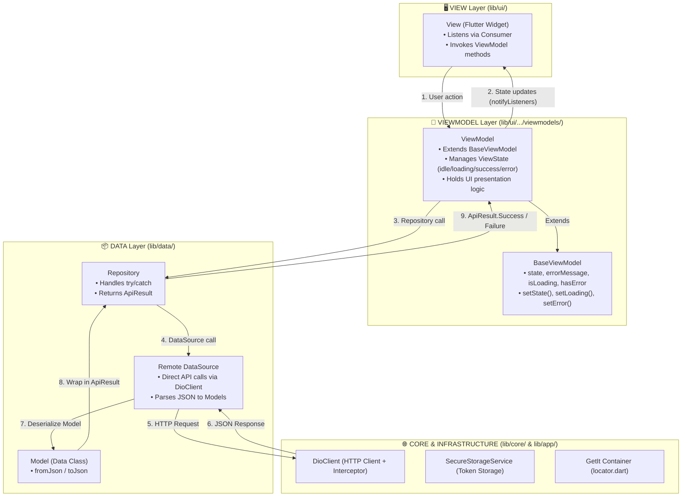

# 🤖 SEAL Mobile - AI Agent Guidelines & Architecture Reference

> **Project**: SEAL Mobile (Student Event Activity Lifecycle)  
> **Framework**: Flutter (SDK ≥ 3.12.2) & Dart (≥ 3.12.2)  
> **Architecture**: MVVM (Model – View – ViewModel) + Repository Pattern  
> **State Management**: Provider (6.1.2) + BaseViewModel (`ChangeNotifier`)  
> **Dependency Injection**: GetIt (9.2.1) Service Locator ([locator.dart](file:///D:/PRM/seal-mobile/lib/app/di/locator.dart))  
> **HTTP Client**: Dio (5.11.0) via `DioClient` (Interceptors & Token Auto-Refresh)  
> **Navigation**: Centralized `AppRouter` (`onGenerateRoute`)  

---

## 📑 Table of Contents

- [1. Architecture Overview & Core Directives](#1-architecture-overview--core-directives)
- [2. Complete Project Directory Structure](#2-complete-project-directory-structure)
- [3. Code Patterns & Implementation Source Code](#3-code-patterns--implementation-source-code)
  - [3.1 ViewState & BaseViewModel](#31-viewstate--baseviewmodel)
  - [3.2 Network Layer & ApiResult](#32-network-layer--apiresult)
  - [3.3 Remote DataSource Pattern](#33-remote-datasource-pattern)
  - [3.4 Repository Pattern](#34-repository-pattern)
  - [3.5 ViewModel Pattern](#35-viewmodel-pattern)
  - [3.6 View (UI) Binding Pattern](#36-view-ui-binding-pattern)
  - [3.7 Dependency Injection (`locator.dart`)](#37-dependency-injection-locatordart)
  - [3.8 Centralized Routing (`app_router.dart`)](#38-centralized-routing-app_routerdart)
- [4. Anti-Patterns & Strict Boundaries](#4-anti-patterns--strict-boundaries)
- [5. Step-by-Step SOP for Feature Implementation](#5-step-by-step-sop-for-feature-implementation)
- [6. Quality & Verification Checklist](#6-quality--verification-checklist)

---

## 1. Architecture Overview & Core Directives

SEAL Mobile strictly uses **MVVM (Model-View-ViewModel)** with **Repository Pattern**.



### Core Directives for AI Agents

1. **Strict Layer Separation**:
   - **View** (`lib/ui/<feature>/views/`): Pure UI rendering. No API calls, no business logic.
   - **ViewModel** (`lib/ui/<feature>/viewmodels/`): Business logic & state management. Must extend `BaseViewModel`.
   - **Repository** (`lib/data/repositories/`): Data abstraction layer. Catches exceptions and returns `ApiResult<T>`.
   - **DataSource** (`lib/data/datasources/`): Makes REST requests using `DioClient` and deserializes JSON to Models.
   - **Model** (`lib/data/models/<feature>/`): Dart classes with `fromJson()` and `toJson()` constructors.
2. **State Management via `BaseViewModel`**:
   - Always extend `BaseViewModel` for feature ViewModels.
   - Manage state using `setLoading()`, `setSuccess()`, `setError(msg)`, and `setIdle()`.
3. **Dependency Injection in [`locator.dart`](file:///D:/PRM/seal-mobile/lib/app/di/locator.dart)**:
   - Register Services, DataSources, and Repositories as `lazySingleton`.
   - Register screen ViewModels as `factory` (except global shared ViewModels like `ProfileViewModel` and `UserRoleViewModel` which are `lazySingleton`).

---

## 2. Complete Project Directory Structure

```
lib/
├── main.dart                          # App Entry Point (setupLocator() & runApp())
│
├── app/                               # Application Core Configuration
│   ├── app.dart                       # Root Widget (MultiProvider + MaterialApp)
│   ├── di/
│   │   └── locator.dart               # GetIt Service Locator Registration
│   ├── router/
│   │   ├── app_router.dart            # Navigation Router (onGenerateRoute)
│   │   └── route_names.dart           # String Constants for Routes (/login, /events...)
│   └── theme/
│       ├── app_colors.dart            # App Color Tokens (Primary, Background...)
│       └── app_theme.dart             # Material 3 ThemeData Configuration
│
├── core/                              # Infrastructure & Core Utilities
│   ├── base/
│   │   ├── base_viewmodel.dart        # Abstract BaseViewModel Class
│   │   └── view_state.dart            # ViewState Enum (idle, loading, success, error)
│   ├── constants/
│   │   ├── api_endpoints.dart         # Base URL & REST Endpoint Constants
│   │   └── storage_keys.dart          # Secure Storage Key Constants
│   ├── context/
│   │   └── user_role_context.dart     # Active User Role Context Tracker
│   ├── errors/
│   │   └── exceptions.dart            # Custom Exception Classes
│   ├── network/
│   │   ├── api_response.dart          # REST Envelope Wrapper
│   │   ├── api_result.dart            # Sealed Class: Success<T> | Failure<T>
│   │   ├── dio_client.dart            # Dio HTTP Client + Token Refresh Interceptor
│   │   └── paginated_data.dart        # Pagination Response Wrapper
│   ├── storage/
│   │   └── secure_storage_service.dart # FlutterSecureStorage Wrapper
│   └── utils/
│       ├── date_formatter.dart        # DateTime Utilities
│       ├── error_mapper.dart          # Exception to User Message Mapper
│       └── validators.dart            # Form Input Validation Logic
│
├── data/                              # Data & Domain Layer
│   ├── datasources/                   # Remote Data Sources (Direct API via DioClient)
│   │   ├── auth_remote_datasource.dart
│   │   ├── event_remote_datasource.dart
│   │   ├── event_role_remote_datasource.dart
│   │   ├── final_result_remote_datasource.dart
│   │   ├── score_remote_datasource.dart
│   │   ├── storage_remote_datasource.dart
│   │   ├── submit_result_remote_datasource.dart
│   │   ├── team_remote_datasource.dart
│   │   ├── track_remote_datasource.dart
│   │   └── user_remote_datasource.dart
│   ├── models/                        # Data Transfer Objects & Requests
│   │   ├── auth/                      # auth_response.dart, login_request.dart, register_request.dart, student_profile_model.dart
│   │   ├── event/                     # event_model.dart, track_model.dart
│   │   ├── event_role/                # event_role_model.dart
│   │   ├── invitation/                # my_invitations_model.dart
│   │   ├── score/                     # criteria_score_model.dart, final_result_model.dart, judge_score_model.dart, score_breakdown_model.dart, submission_score_model.dart
│   │   ├── submission/                # submit_result_model.dart
│   │   ├── team/                      # team_invitation_model.dart, team_member_model.dart, team_model.dart
│   │   └── user/                      # user_profile_model.dart
│   └── repositories/                  # Repositories (Data Handling & ApiResult wrapping)
│       ├── auth_repository.dart
│       ├── event_repository.dart
│       ├── event_role_repository.dart
│       ├── final_result_repository.dart
│       ├── score_repository.dart
│       ├── storage_repository.dart
│       ├── submission_repository.dart
│       ├── team_repository.dart
│       ├── track_repository.dart
│       └── user_repository.dart
│
└── ui/                                # Presentation Layer (Feature Modules)
    ├── auth/                          # Authentication Feature
    │   ├── viewmodels/ (login_viewmodel.dart, register_viewmodel.dart)
    │   └── views/      (login_view.dart, register_view.dart)
    ├── common/                        # Common Shared UI & ViewModels
    │   ├── viewmodels/ (user_role_viewmodel.dart)
    │   └── widgets/    (app_button.dart, app_text_field.dart, loading_indicator.dart)
    ├── event/                         # Event Management Feature
    │   ├── viewmodels/ (event_viewmodel.dart)
    │   └── views/      (event_detail_view.dart, event_list_view.dart)
    ├── home/                          # Home Dashboard Feature
    │   ├── viewmodels/ (home_viewmodel.dart)
    │   └── views/      (home_view.dart)
    ├── mentor/                        # Mentor Evaluation & Leaderboard Feature
    │   ├── viewmodels/ (mentor_dashboard_viewmodel.dart, mentor_ranking_viewmodel.dart, mentor_viewmodel.dart, team_score_breakdown_viewmodel.dart)
    │   └── views/      (mentor_dashboard_view.dart, mentor_ranking_view.dart, mentor_team_list_view.dart, team_score_breakdown_view.dart)
    ├── profile/                       # User Profile Feature
    │   ├── viewmodels/ (profile_viewmodel.dart)
    │   └── views/      (profile_view.dart)
    ├── submission/                    # Project Submission Feature
    │   ├── viewmodels/ (submission_viewmodel.dart)
    │   └── views/      (submit_result_view.dart)
    └── team/                          # Team Management Feature
        ├── viewmodels/ (team_viewmodel.dart)
        └── views/      (create_team_view.dart, my_team_view.dart)
```

---

## 3. Code Patterns & Implementation Source Code

### 3.1 ViewState & BaseViewModel

From [`lib/core/base/view_state.dart`](file:///D:/PRM/seal-mobile/lib/core/base/view_state.dart) and [`lib/core/base/base_viewmodel.dart`](file:///D:/PRM/seal-mobile/lib/core/base/base_viewmodel.dart):

```dart
// view_state.dart
enum ViewState { idle, loading, success, error }
```

```dart
// base_viewmodel.dart
import 'package:flutter/material.dart';
import 'view_state.dart';

abstract class BaseViewModel extends ChangeNotifier {
  ViewState _state = ViewState.idle;
  String? _errorMessage;

  ViewState get state => _state;
  String? get errorMessage => _errorMessage;

  bool get isLoading => _state == ViewState.loading;
  bool get hasError => _state == ViewState.error;
  bool get isSuccess => _state == ViewState.success;

  void setState(ViewState viewState) {
    _state = viewState;
    notifyListeners();
  }

  void setLoading() => setState(ViewState.loading);
  void setSuccess() => setState(ViewState.success);
  void setIdle() => setState(ViewState.idle);

  void setError(String? message) {
    _errorMessage = message;
    setState(ViewState.error);
  }

  void clearError() {
    _errorMessage = null;
    if (_state == ViewState.error) {
      setState(ViewState.idle);
    }
  }
}
```

---

### 3.2 Network Layer & ApiResult

From [`lib/core/network/api_result.dart`](file:///D:/PRM/seal-mobile/lib/core/network/api_result.dart):

```dart
abstract class ApiResult<T> {
  const ApiResult();
}

class Success<T> extends ApiResult<T> {
  final T data;
  const Success(this.data);
}

class Failure<T> extends ApiResult<T> {
  final Exception exception;
  const Failure(this.exception);
}
```

---

### 3.3 Remote DataSource Pattern

From [`lib/data/datasources/auth_remote_datasource.dart`](file:///D:/PRM/seal-mobile/lib/data/datasources/auth_remote_datasource.dart):

```dart
import '../../core/constants/api_endpoints.dart';
import '../../core/network/dio_client.dart';
import '../models/auth/auth_response.dart';
import '../models/auth/login_request.dart';

class AuthRemoteDataSource {
  final DioClient _dioClient;

  AuthRemoteDataSource(this._dioClient);

  Future<AuthResponse> login(LoginRequest request) async {
    final response = await _dioClient.post(
      ApiEndpoints.login,
      data: request.toJson(),
    );
    return AuthResponse.fromJson(response.data['data']);
  }
}
```

---

### 3.4 Repository Pattern

From [`lib/data/repositories/auth_repository.dart`](file:///D:/PRM/seal-mobile/lib/data/repositories/auth_repository.dart):

```dart
import '../../core/network/api_result.dart';
import '../datasources/auth_remote_datasource.dart';
import '../models/auth/auth_response.dart';
import '../models/auth/login_request.dart';

class AuthRepository {
  final AuthRemoteDataSource _remoteDataSource;

  AuthRepository(this._remoteDataSource);

  Future<ApiResult<AuthResponse>> login(String email, String password) async {
    try {
      final request = LoginRequest(email: email, password: password);
      final response = await _remoteDataSource.login(request);
      return Success(response);
    } on Exception catch (e) {
      return Failure(e);
    }
  }
}
```

---

### 3.5 ViewModel Pattern

From [`lib/ui/auth/viewmodels/login_viewmodel.dart`](file:///D:/PRM/seal-mobile/lib/ui/auth/viewmodels/login_viewmodel.dart):

```dart
import '../../../core/base/base_viewmodel.dart';
import '../../../core/network/api_result.dart';
import '../../../core/storage/secure_storage_service.dart';
import '../../../core/utils/error_mapper.dart';
import '../../../data/repositories/auth_repository.dart';

class LoginViewModel extends BaseViewModel {
  final AuthRepository _authRepository;
  final SecureStorageService _storageService;

  LoginViewModel(this._authRepository, this._storageService);

  Future<bool> login(String email, String password) async {
    setLoading();
    final result = await _authRepository.login(email, password);

    if (result is Success) {
      final authResponse = (result as Success).data;
      await _storageService.writeAccessToken(authResponse.accessToken);
      await _storageService.writeRefreshToken(authResponse.refreshToken);
      setSuccess();
      return true;
    } else if (result is Failure) {
      final exception = (result as Failure).exception;
      setError(ErrorMapper.mapExceptionToMessage(exception));
      return false;
    }
    return false;
  }
}
```

---

### 3.6 View (UI) Binding Pattern

From [`lib/ui/auth/views/login_view.dart`](file:///D:/PRM/seal-mobile/lib/ui/auth/views/login_view.dart):

```dart
import 'package:flutter/material.dart';
import 'package:provider/provider.dart';
import '../../../app/di/locator.dart';
import '../viewmodels/login_viewmodel.dart';

class LoginView extends StatelessWidget {
  const LoginView({Key? key}) : super(key: key);

  @override
  Widget build(BuildContext context) {
    return ChangeNotifierProvider(
      create: (_) => locator<LoginViewModel>(),
      child: Consumer<LoginViewModel>(
        builder: (context, viewModel, child) {
          return Scaffold(
            body: viewModel.isLoading
                ? const Center(child: CircularProgressIndicator())
                : Column(
                    children: [
                      if (viewModel.hasError)
                        Text(viewModel.errorMessage ?? 'Có lỗi xảy ra'),
                      ElevatedButton(
                        onPressed: () => viewModel.login('user@example.com', 'password'),
                        child: const Text('Đăng nhập'),
                      ),
                    ],
                  ),
          );
        },
      ),
    );
  }
}
```

---

### 3.7 Dependency Injection ([`locator.dart`](file:///D:/PRM/seal-mobile/lib/app/di/locator.dart))

```dart
import 'package:get_it/get_it.dart';
import '../../core/network/dio_client.dart';
import '../../core/storage/secure_storage_service.dart';
import '../../core/context/user_role_context.dart';

// Data Sources
import '../../data/datasources/auth_remote_datasource.dart';
import '../../data/datasources/event_remote_datasource.dart';
import '../../data/datasources/team_remote_datasource.dart';
import '../../data/datasources/submit_result_remote_datasource.dart';
import '../../data/datasources/user_remote_datasource.dart';
import '../../data/datasources/event_role_remote_datasource.dart';
import '../../data/datasources/storage_remote_datasource.dart';
import '../../data/datasources/track_remote_datasource.dart';
import '../../data/datasources/score_remote_datasource.dart';
import '../../data/datasources/final_result_remote_datasource.dart';

// Repositories
import '../../data/repositories/auth_repository.dart';
import '../../data/repositories/event_repository.dart';
import '../../data/repositories/team_repository.dart';
import '../../data/repositories/submission_repository.dart';
import '../../data/repositories/user_repository.dart';
import '../../data/repositories/event_role_repository.dart';
import '../../data/repositories/storage_repository.dart';
import '../../data/repositories/track_repository.dart';
import '../../data/repositories/score_repository.dart';
import '../../data/repositories/final_result_repository.dart';

// ViewModels
import '../../ui/auth/viewmodels/login_viewmodel.dart';
import '../../ui/auth/viewmodels/register_viewmodel.dart';
import '../../ui/event/viewmodels/event_viewmodel.dart';
import '../../ui/team/viewmodels/team_viewmodel.dart';
import '../../ui/submission/viewmodels/submission_viewmodel.dart';
import '../../ui/profile/viewmodels/profile_viewmodel.dart';
import '../../ui/common/viewmodels/user_role_viewmodel.dart';
import '../../ui/home/viewmodels/home_viewmodel.dart';
import '../../ui/mentor/viewmodels/mentor_dashboard_viewmodel.dart';
import '../../ui/mentor/viewmodels/mentor_ranking_viewmodel.dart';
import '../../ui/mentor/viewmodels/mentor_viewmodel.dart';
import '../../ui/mentor/viewmodels/team_score_breakdown_viewmodel.dart';

final GetIt locator = GetIt.instance;

void setupLocator() {
  // Services & Context (Singletons)
  locator.registerLazySingleton<DioClient>(() => DioClient());
  locator.registerLazySingleton<SecureStorageService>(() => SecureStorageService());
  locator.registerLazySingleton<UserRoleContext>(() => UserRoleContext());

  // Data sources (Lazy Singletons)
  locator.registerLazySingleton<AuthRemoteDataSource>(() => AuthRemoteDataSource(locator<DioClient>()));
  locator.registerLazySingleton<EventRemoteDataSource>(() => EventRemoteDataSource(locator<DioClient>()));
  locator.registerLazySingleton<TeamRemoteDataSource>(() => TeamRemoteDataSource(locator<DioClient>()));
  locator.registerLazySingleton<SubmitResultRemoteDataSource>(() => SubmitResultRemoteDataSource(locator<DioClient>()));
  locator.registerLazySingleton<UserRemoteDataSource>(() => UserRemoteDataSource(locator<DioClient>()));
  locator.registerLazySingleton<EventRoleRemoteDataSource>(() => EventRoleRemoteDataSource(locator<DioClient>()));
  locator.registerLazySingleton<StorageRemoteDataSource>(() => StorageRemoteDataSource(locator<DioClient>()));
  locator.registerLazySingleton<TrackRemoteDataSource>(() => TrackRemoteDataSource(locator<DioClient>()));
  locator.registerLazySingleton<ScoreRemoteDataSource>(() => ScoreRemoteDataSource(locator<DioClient>()));
  locator.registerLazySingleton<FinalResultRemoteDataSource>(() => FinalResultRemoteDataSource(locator<DioClient>()));

  // Repositories (Lazy Singletons)
  locator.registerLazySingleton<AuthRepository>(() => AuthRepository(locator<AuthRemoteDataSource>()));
  locator.registerLazySingleton<EventRepository>(() => EventRepository(locator<EventRemoteDataSource>()));
  locator.registerLazySingleton<TeamRepository>(() => TeamRepository(locator<TeamRemoteDataSource>()));
  locator.registerLazySingleton<SubmissionRepository>(() => SubmissionRepository(locator<SubmitResultRemoteDataSource>()));
  locator.registerLazySingleton<UserRepository>(() => UserRepository(locator<UserRemoteDataSource>()));
  locator.registerLazySingleton<EventRoleRepository>(() => EventRoleRepository(locator<EventRoleRemoteDataSource>()));
  locator.registerLazySingleton<StorageRepository>(() => StorageRepository(locator<StorageRemoteDataSource>()));
  locator.registerLazySingleton<TrackRepository>(() => TrackRepository(locator<TrackRemoteDataSource>()));
  locator.registerLazySingleton<ScoreRepository>(() => ScoreRepository(locator<ScoreRemoteDataSource>()));
  locator.registerLazySingleton<FinalResultRepository>(() => FinalResultRepository(locator<FinalResultRemoteDataSource>()));

  // Global ViewModels (Lazy Singletons)
  locator.registerLazySingleton<UserRoleViewModel>(() => UserRoleViewModel(locator<EventRoleRepository>()));
  locator.registerLazySingleton<ProfileViewModel>(() => ProfileViewModel(locator<UserRepository>()));

  // Per-View ViewModels (Factories)
  locator.registerFactory<HomeViewModel>(() => HomeViewModel(locator<EventRoleRepository>(), locator<UserRoleContext>()));
  locator.registerFactory<LoginViewModel>(() => LoginViewModel(locator<AuthRepository>(), locator<SecureStorageService>()));
  locator.registerFactory<RegisterViewModel>(() => RegisterViewModel(locator<AuthRepository>()));
  locator.registerFactory<EventViewModel>(() => EventViewModel(locator<EventRepository>()));
  locator.registerFactory<TeamViewModel>(() => TeamViewModel(locator<TeamRepository>()));
  locator.registerFactory<SubmissionViewModel>(() => SubmissionViewModel(locator<SubmissionRepository>()));
  locator.registerFactory<MentorViewModel>(() => MentorViewModel(locator<TrackRepository>(), locator<TeamRepository>(), locator<ScoreRepository>(), locator<FinalResultRepository>()));
  locator.registerFactory<MentorDashboardViewModel>(() => MentorDashboardViewModel(locator<TeamRepository>(), locator<UserRoleContext>()));
  locator.registerFactory<TeamScoreBreakdownViewModel>(() => TeamScoreBreakdownViewModel(locator<ScoreRepository>()));
  locator.registerFactory<MentorRankingViewModel>(() => MentorRankingViewModel(locator<FinalResultRepository>()));
}
```

---

### 3.8 Centralized Routing ([`app_router.dart`](file:///D:/PRM/seal-mobile/lib/app/router/app_router.dart))

```dart
import 'package:flutter/material.dart';
import '../../ui/auth/views/login_view.dart';
import '../../ui/auth/views/register_view.dart';
import '../../ui/event/views/event_list_view.dart';
import '../../ui/event/views/event_detail_view.dart';
import '../../ui/home/views/home_view.dart';
import '../../ui/mentor/views/mentor_dashboard_view.dart';
import '../../ui/team/views/my_team_view.dart';
import '../../ui/team/views/create_team_view.dart';
import '../../ui/submission/views/submit_result_view.dart';
import '../../ui/profile/views/profile_view.dart';
import 'route_names.dart';

class AppRouter {
  static Route<dynamic> generateRoute(RouteSettings settings) {
    switch (settings.name) {
      case RouteNames.login:
        return MaterialPageRoute(builder: (_) => const LoginView());
      case RouteNames.register:
        return MaterialPageRoute(builder: (_) => const RegisterView());
      case RouteNames.home:
        return MaterialPageRoute(builder: (_) => const HomeView());
      case RouteNames.eventList:
        return MaterialPageRoute(builder: (_) => const EventListView());
      case RouteNames.eventDetail:
        return MaterialPageRoute(builder: (_) => const EventDetailView());
      case RouteNames.myTeam:
        return MaterialPageRoute(builder: (_) => const MyTeamView());
      case RouteNames.createTeam:
        return MaterialPageRoute(builder: (_) => const CreateTeamView());
      case RouteNames.submitResult:
        return MaterialPageRoute(builder: (_) => const SubmitResultView());
      case RouteNames.profile:
        return MaterialPageRoute(builder: (_) => const ProfileView());
      case RouteNames.mentorDashboard:
        return MaterialPageRoute(builder: (_) => const MentorDashboardView());
      default:
        return MaterialPageRoute(builder: (_) => const LoginView());
    }
  }
}
```

---

## 4. Anti-Patterns & Strict Boundaries

To maintain project consistency, **DO NOT** introduce the following anti-patterns:

| Anti-Pattern | Forbidden Practice | Correct SEAL Mobile Pattern |
|---|---|---|
| ❌ **Alternative State Managers** | Introducing BLoC, Riverpod, Redux, or GetX | Use `Provider` + `BaseViewModel` (`ChangeNotifier`) |
| ❌ **Alternative Routers** | Introducing `go_router` or `auto_route` | Use `AppRouter` with `RouteNames` via `onGenerateRoute` |
| ❌ **Alternative HTTP Clients** | Using raw `http` library | Use `DioClient` (`locator<DioClient>()`) |
| ❌ **Feature-Nested Structure** | Creating `screens/`, `providers/`, `services/` inside feature folders | Place code strictly in `lib/data/` (datasources/models/repositories) and `lib/ui/<feature>/` (viewmodels/views) |
| ❌ **API Logic in Widgets** | Calling Dio or HTTP directly inside Flutter Widgets | Invoke ViewModel methods inside `Consumer<T>` / `Provider.of` |
| ❌ **Direct Exception Throwing in Views** | Unhandled network exceptions crashing UI | Repositories return `ApiResult<T>`, ViewModel converts with `ErrorMapper` |

---

## 5. Step-by-Step SOP for Feature Implementation

When implementing a new feature, follow this exact 8-step workflow:

1. **Step 1: REST Endpoint**: Add path constant to [`lib/core/constants/api_endpoints.dart`](file:///D:/PRM/seal-mobile/lib/core/constants/api_endpoints.dart).
2. **Step 2: Models**: Add JSON entity/dto classes under `lib/data/models/<feature>/` with `fromJson` & `toJson`.
3. **Step 3: DataSource**: Add `lib/data/datasources/<feature>_remote_datasource.dart` calling `DioClient`.
4. **Step 4: Repository**: Add `lib/data/repositories/<feature>_repository.dart` wrapping API calls in `try/catch` and returning `ApiResult<T>`.
5. **Step 5: ViewModel**: Add `lib/ui/<feature>/viewmodels/<feature>_viewmodel.dart` extending `BaseViewModel`.
6. **Step 6: Dependency Injection**: Register DataSource, Repository, and ViewModel in [`lib/app/di/locator.dart`](file:///D:/PRM/seal-mobile/lib/app/di/locator.dart).
7. **Step 7: Route**: Add route constant to [`lib/app/router/route_names.dart`](file:///D:/PRM/seal-mobile/lib/app/router/route_names.dart) and route builder case in [`lib/app/router/app_router.dart`](file:///D:/PRM/seal-mobile/lib/app/router/app_router.dart).
8. **Step 8: View**: Create UI screen widget in `lib/ui/<feature>/views/<feature>_view.dart` consuming ViewModel via `ChangeNotifierProvider` & `Consumer`.

---

## 6. Quality & Verification Checklist

Before completing any coding task:

- [ ] Code passes `flutter analyze` with 0 errors.
- [ ] No direct API/HTTP calls are written inside View Widgets.
- [ ] Feature ViewModel extends `BaseViewModel` and handles state using `setLoading()`, `setSuccess()`, `setError()`.
- [ ] Repository methods return `ApiResult<T>`.
- [ ] All new DataSources, Repositories, and ViewModels are registered in [`locator.dart`](file:///D:/PRM/seal-mobile/lib/app/di/locator.dart).
- [ ] New screens are routed via [`route_names.dart`](file:///D:/PRM/seal-mobile/lib/app/router/route_names.dart) and [`app_router.dart`](file:///D:/PRM/seal-mobile/lib/app/router/app_router.dart).

- **1.2 File Naming Conventions:**
    -  Use `snake_case` for file names (e.g., `user_profile_screen.dart`).
    -  For classes within a file, the file name typically reflects the main class it contains.  Example: `user_profile_screen.dart` containing `UserProfileScreen`.
    -  Exceptions: Grouping multiple related enums, typedefs, or small helper functions into a single file is acceptable if it improves clarity.

- **1.3 Module Organization:**
    -  A module encapsulates a specific feature or functionality.  Modules should have well-defined interfaces and minimize dependencies on other modules.
    -  Implement a layered architecture within each module (e.g., UI, business logic, data access).
    -  Consider using packages for large, independent features to promote reusability across projects.

- **1.4 Component Architecture:**
    -  Favor a component-based architecture using Flutter widgets.  Break down complex UIs into smaller, reusable widgets.
    -  Separate presentation logic from business logic.
    -  Widgets should be pure functions of their input data (state).
    -  Follow the principles of Single Responsibility Principle (SRP) for widget design.

- **1.5 Code Splitting Strategies:**
    -  **Deferred Loading:** Load features on demand to reduce initial app size.
    -  **Route-Based Splitting:** Split code based on app routes.
    -  **Feature-Based Splitting:** Split code based on features.
    -  Use the `dart:ui` library's `loadFontFromList` or `ImageProvider.loadBuffer`  to load font or image resources dynamically.

## 7. Common Patterns and Anti-patterns

- **2.1 Design Patterns Specific to Flutter:**
    -  **BLoC (Business Logic Component):** Separates business logic from the UI, making the code more testable and maintainable.
    -  **Provider:** Simple dependency injection and state management solution.
    -  **Riverpod:** An improved version of Provider with compile-time safety.
    -  **GetX:** A microframework that provides state management, dependency injection, and route management.
    -  **MVVM (Model-View-ViewModel):** Another pattern for separating concerns.  Often used with reactive programming.
    -  **Redux/Flux:** For predictable state management, especially in complex applications.
    -  **InheritedWidget:** Implicit dependency injection for theming and configuration.

- **2.2 Recommended Approaches for Common Tasks:**
    -  **State Management:** Choose a state management solution that fits the complexity of the app.
    -  **Networking:** Use the `http` package or `dio` for making API requests.
    -  **Asynchronous Operations:** Use `async/await` for handling asynchronous operations.
    -  **Data Persistence:** Use `shared_preferences` for simple data storage or SQLite (using packages like `sqflite`) or NoSQL databases (using packages like `hive` or `isar`) for structured data.
    -  **Navigation:** Use `go_router` or `auto_route` for type-safe navigation.
    -  **Form Handling:** Use `Form` widget with `TextFormField` and validators.

- **2.3 Anti-patterns and Code Smells to Avoid:**
    -  **Massive Widgets:** Widgets with too much logic or UI code. Break them down into smaller, reusable components.
    -  **Logic in Widgets:** Avoid putting business logic directly inside widgets.
    -  **Deeply Nested Widgets:** Can lead to performance issues and difficult-to-read code.  Simplify the widget tree.
    -  **Unmanaged State:** Forgetting to dispose of resources like `StreamSubscription` or `AnimationController` leading to memory leaks.
    -  **Hardcoded Values:** Avoid hardcoding values like colors, sizes, and strings in the code. Use constants or theme data.
    -  **Ignoring Errors:** Not handling exceptions properly can lead to unexpected crashes.  Use `try-catch` blocks and logging.

- **2.4 State Management Best Practices:**
    -  Choose a state management solution that fits the complexity of the app.
    -  Keep the state as close to where it is needed as possible. Avoid global state for everything.
    -  Use immutable data structures to prevent unexpected state changes.
    -  Separate state from UI components to improve testability.
    -  Manage side effects properly.
    -  Consider reactive programming with streams for complex state transitions.

- **2.5 Error Handling Patterns:**
    -  Use `try-catch` blocks to handle exceptions.
    -  Implement custom error classes for specific error scenarios.
    -  Log errors to a file or remote service for debugging.
    -  Show user-friendly error messages.
    -  Use `ErrorWidget` to display custom error screens.
    -  Handle asynchronous errors using `Future.catchError` or `Stream.handleError`.

## 8. Performance Considerations

- **3.1 Optimization Techniques:**
    -  **Avoid Unnecessary Widget Rebuilds:** Use `const` constructors for immutable widgets, `shouldRebuild` method in `StatefulWidget`, and `ValueKey` for widgets that change position in a list.
    -  **Minimize `setState` Calls:** Use state management solutions to optimize state updates.
    -  **Use `ListView.builder` or `GridView.builder`:**  For large lists or grids, build widgets lazily.
    -  **Use `RepaintBoundary`:**  Isolate parts of the UI that don't need to be repainted often.
    -  **Use `Opacity` and `Clip` Sparingly:**  These operations can be expensive.
    -  **Use `Transform` carefully:** transforms can break batching and cause additional draw calls.

- **3.2 Memory Management:**
    -  Dispose of resources like `StreamSubscription`, `AnimationController`, and `TextEditingController` in the `dispose` method.
    -  Avoid creating unnecessary objects.
    -  Use the `dart:developer` package's memory profiling tools to identify memory leaks.
    -  Minimize the use of global variables and static fields.

- **3.3 Rendering Optimization:**
    -  Use the Flutter Performance Overlay to identify performance bottlenecks.
    -  Reduce the complexity of the widget tree.
    -  Optimize image loading and caching.
    -  Avoid using custom paint operations unless necessary.

- **3.4 Bundle Size Optimization:**
    -  Use `flutter build apk --split-per-abi` or `flutter build appbundle` to split the APK/AAB by ABI (Application Binary Interface).
    -  Remove unused assets and code.
    -  Compress images.
    -  Use code obfuscation and minification.
    -  Use deferred loading for infrequently used features.

- **3.5 Lazy Loading Strategies:**
    -  **Image Lazy Loading:** Load images only when they are visible on the screen.
    -  **Data Lazy Loading:** Load data in chunks as the user scrolls.
    -  Use the `VisibilityDetector` package to detect when a widget becomes visible.
    -  Use pagination or infinite scrolling for large datasets.

## 9. Security Best Practices

- **4.1 Common Vulnerabilities and How to Prevent Them:**
    -  **Data Injection:** Sanitize user input to prevent SQL injection, XSS, and other injection attacks.
    -  **Sensitive Data Storage:** Avoid storing sensitive data in plain text. Use encryption and secure storage mechanisms.
    -  **Insecure API Communication:** Use HTTPS for all API communication.
    -  **Code Tampering:** Use code obfuscation to make it harder to reverse engineer the app.
    -  **Man-in-the-Middle Attacks:** Implement certificate pinning to prevent MITM attacks.

- **4.2 Input Validation:**
    -  Validate all user input on both the client and server sides.
    -  Use regular expressions or custom validation logic to enforce data constraints.
    -  Encode data properly before displaying it in the UI.

- **4.3 Authentication and Authorization Patterns:**
    -  Use secure authentication protocols like OAuth 2.0 or OpenID Connect.
    -  Implement multi-factor authentication (MFA) for added security.
    -  Use role-based access control (RBAC) to restrict access to sensitive data and functionality.
    -  Store authentication tokens securely.

- **4.4 Data Protection Strategies:**
    -  Encrypt sensitive data at rest and in transit.
    -  Use secure storage mechanisms like the Keychain (iOS) or Keystore (Android).
    -  Follow the principle of least privilege when granting access to data.

- **4.5 Secure API Communication:**
    -  Use HTTPS for all API communication.
    -  Implement proper authentication and authorization.
    -  Validate API responses.
    -  Rate limit API requests to prevent abuse.

## 10. Testing Approaches

- **5.1 Unit Testing Strategies:**
    -  Test individual functions, classes, and widgets in isolation.
    -  Use mock objects to isolate the code under test from its dependencies.
    -  Write tests for all critical business logic.

- **5.2 Integration Testing:**
    -  Test the interaction between different parts of the app.
    -  Test the integration with external services like APIs and databases.

- **5.3 End-to-End Testing:**
    -  Test the entire app from start to finish.
    -  Simulate user interactions to ensure that the app works as expected.

- **5.4 Test Organization:**
    -  Create a `test/` directory that mirrors the `lib/` directory structure.
    -  Use descriptive test names.
    -  Keep tests small and focused.

- **5.5 Mocking and Stubbing:**
    -  Use mocking frameworks like `mockito` to create mock objects.
    -  Use stubbing to replace external dependencies with predefined values.
    -  Avoid over-mocking, as it can make tests less effective.

## 11. Common Pitfalls and Gotchas

- **6.1 Frequent Mistakes Developers Make:**
    -  Not disposing of resources.
    -  Ignoring errors.
    -  Hardcoding values.
    -  Using `setState` excessively.
    -  Creating massive widgets.
    -  Not validating user input.
    -  Over-complicating the state management.

- **6.2 Edge Cases to Be Aware Of:**
    -  Network connectivity issues.
    -  Device orientation changes.
    -  Background app state.
    -  Low memory conditions.
    -  Localization and internationalization.

- **6.3 Version-Specific Issues:**
    -  Be aware of breaking changes in new Flutter releases.
    -  Test the app on different Flutter versions to ensure compatibility.
    -  Use version constraints in `pubspec.yaml` to specify the required Flutter version.

- **6.4 Compatibility Concerns:**
    -  Test the app on different devices and operating systems.
    -  Consider accessibility for users with disabilities.
    -  Follow platform-specific guidelines for UI and functionality.

- **6.5 Debugging Strategies:**
    -  Use the Flutter DevTools for debugging and profiling.
    -  Use logging to track down errors.
    -  Use breakpoints to step through the code.
    -  Use the Flutter Inspector to inspect the widget tree.

## 12. Tooling and Environment

- **7.1 Recommended Development Tools:**
    -  Visual Studio Code or Android Studio.
    -  Flutter DevTools.
    -  Android Emulator or iOS Simulator.
    -  Git for version control.

- **7.2 Build Configuration:**
    -  Use `flutter build` to build the app for different platforms.
    -  Configure build settings in `pubspec.yaml`.
    -  Use different build configurations for development, staging, and production.

- **7.3 Linting and Formatting:**
    -  Use `flutter_lints` package for linting.
    -  Use `dart format` or Prettier for code formatting.
    -  Configure the IDE to automatically format the code on save.
