# 🦭 SEAL Mobile

> **Student Event Activity Lifecycle** — Ứng dụng di động Flutter dành cho sinh viên tham gia và quản lý các sự kiện, cuộc thi trong trường đại học.

---

## 📑 Mục Lục

- [Tổng Quan](#-tổng-quan)
- [Công Nghệ Sử Dụng](#-công-nghệ-sử-dụng)
- [Kiến Trúc Ứng Dụng (MVVM)](#-kiến-trúc-ứng-dụng-mvvm)
- [Dependency Injection & Singleton Pattern](#-dependency-injection--singleton-pattern)
- [Cấu Trúc Thư Mục](#-cấu-trúc-thư-mục)
- [Sơ Đồ Vận Hành Hệ Thống](#-sơ-đồ-vận-hành-hệ-thống)
- [Luồng Người Dùng (Sinh Viên)](#-luồng-người-dùng-sinh-viên)
- [Cài Đặt & Chạy Dự Án](#-cài-đặt--chạy-dự-án)

---

## 🔎 Tổng Quan

SEAL Mobile là ứng dụng di động được xây dựng bằng **Flutter**, kết nối với Backend REST API để cung cấp cho sinh viên các chức năng:

- **Xác thực:** Đăng ký, đăng nhập, xác thực email, làm mới token tự động.
- **Sự kiện:** Xem danh sách sự kiện, chi tiết sự kiện, các track thi đấu.
- **Nhóm:** Tạo nhóm, mời thành viên, quản lý nhóm thi.
- **Nộp bài:** Upload bài dự thi, xem kết quả chấm điểm.
- **Hồ sơ:** Xem và quản lý thông tin cá nhân, trạng thái phê duyệt tài khoản.

---

## 🛠 Công Nghệ Sử Dụng

| Công nghệ | Phiên bản | Vai trò |
|---|---|---|
| **Flutter** | SDK ≥ 3.12.2 | Framework xây dựng giao diện đa nền tảng (Android & iOS) |
| **Dart** | ≥ 3.12.2 | Ngôn ngữ lập trình chính |
| **Dio** | 5.11.0 | HTTP Client — gửi/nhận request đến REST API |
| **Provider** | 6.1.2 | State Management — triển khai MVVM, lắng nghe thay đổi trạng thái |
| **GetIt** | 9.2.1 | Service Locator / Dependency Injection container |
| **Flutter Secure Storage** | 11.0.0 | Lưu trữ bảo mật (access token, refresh token) trên thiết bị |
| **intl** | 0.20.3 | Định dạng ngày tháng, đa ngôn ngữ |
| **Material Design 3** | Built-in | Hệ thống thiết kế giao diện (theme, color scheme, typography) |

---

## 🏗 Kiến Trúc Ứng Dụng (MVVM)

Dự án áp dụng kiến trúc **MVVM (Model – View – ViewModel)** kết hợp **Repository Pattern** để tách biệt rõ ràng các tầng trách nhiệm:

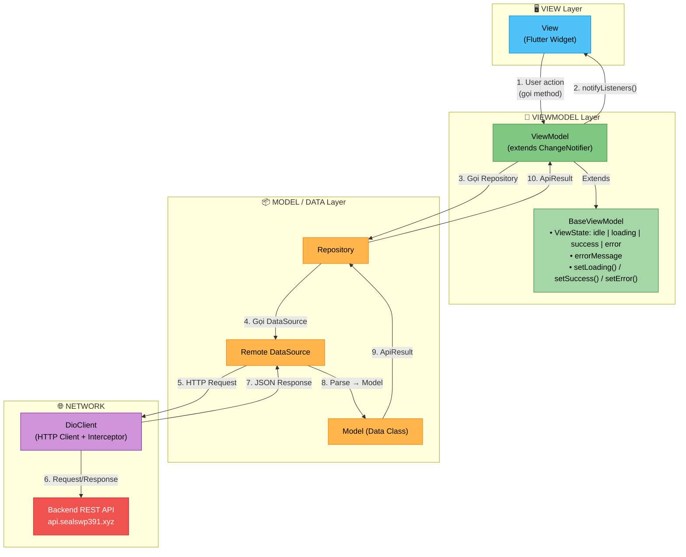

### Giải thích từng tầng

#### 1. View (Giao diện)
- Là các **Flutter Widget** (`StatefulWidget` / `StatelessWidget`).
- Chỉ chịu trách nhiệm **hiển thị dữ liệu** và **nhận thao tác** từ người dùng.
- Lắng nghe thay đổi từ ViewModel thông qua `Consumer<T>` hoặc `Provider.of<T>(context)`.
- **Không chứa business logic**, không gọi trực tiếp API.

#### 2. ViewModel (Xử lý logic)
- Kế thừa từ `BaseViewModel` (extends `ChangeNotifier`).
- Quản lý **trạng thái UI** qua enum `ViewState {idle, loading, success, error}`.
- Gọi Repository để lấy/gửi dữ liệu, sau đó gọi `notifyListeners()` để cập nhật View.
- Xử lý **validation**, **error mapping**, **state transitions**.

#### 3. Repository (Kho dữ liệu)
- Là **lớp trung gian** giữa ViewModel và DataSource.
- Bọc kết quả trả về trong `ApiResult<T>` (sealed class) gồm 2 case:
  - `Success<T>(data)` — thành công, chứa dữ liệu.
  - `Failure<T>(exception)` — thất bại, chứa exception.
- Xử lý **try/catch** và chuyển đổi lỗi mạng thành `ApiResult.Failure`.

#### 4. DataSource (Nguồn dữ liệu)
- Gọi trực tiếp API thông qua `DioClient`.
- Parse JSON response thành **Model** (Data Class) bằng `fromJson()`.
- Không xử lý business logic — chỉ chịu trách nhiệm giao tiếp mạng.

#### 5. Model (Dữ liệu)
- Các class thuần Dart đại diện cho dữ liệu (`AuthResponse`, `EventModel`, `TeamModel`, ...).
- Chứa `fromJson()` factory constructor để parse từ JSON.
- Chứa `toJson()` method để serialize thành JSON khi gửi request.

---

## 💉 Dependency Injection & Singleton Pattern

### Service Locator Pattern (GetIt)

Dự án sử dụng thư viện **GetIt** làm **Service Locator** — một dạng triển khai Dependency Injection (DI) phổ biến trong Flutter. Toàn bộ cấu hình DI nằm trong file `locator.dart`.

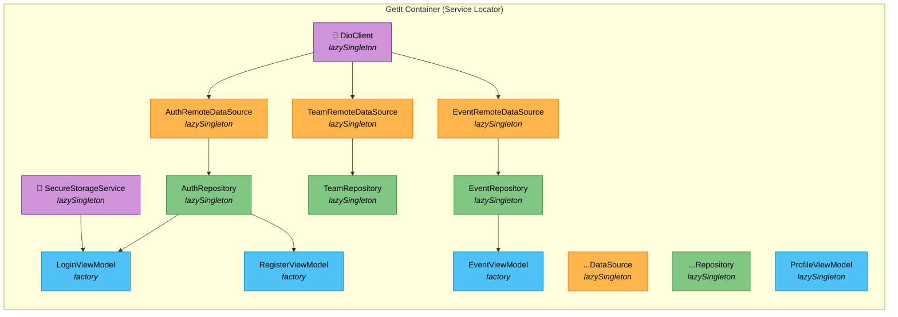

### Hai kiểu đăng ký trong GetIt

| Kiểu | Phương thức | Ý nghĩa | Dùng cho |
|---|---|---|---|
| **Lazy Singleton** | `registerLazySingleton<T>()` | Tạo **duy nhất 1 instance** khi lần đầu được yêu cầu, các lần sau trả về cùng instance đó | `DioClient`, `SecureStorageService`, tất cả `DataSource`, `Repository`, `ProfileViewModel` |
| **Factory** | `registerFactory<T>()` | Tạo **instance mới mỗi lần** được yêu cầu | `LoginViewModel`, `RegisterViewModel`, `EventViewModel`, `TeamViewModel`, `SubmissionViewModel` |

### Tại sao dùng Singleton cho DioClient?

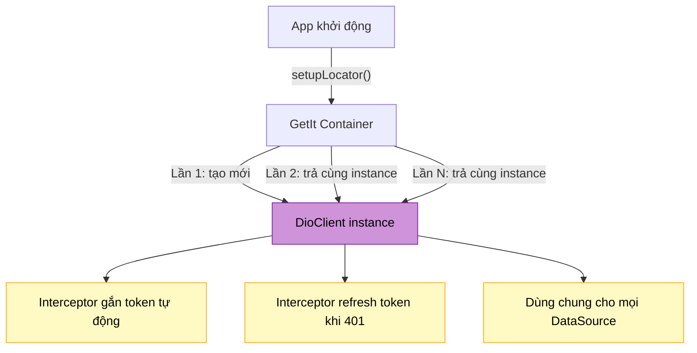

- **DioClient** được đăng ký là `lazySingleton` → chỉ có **1 Dio instance duy nhất** trong toàn bộ app.
- Mọi `DataSource` đều nhận cùng 1 `DioClient` → đảm bảo mọi API call đều đi qua **cùng 1 Interceptor** (tự động gắn Bearer token, tự động refresh token khi hết hạn).
- Nếu dùng `factory`, mỗi DataSource sẽ tạo Dio riêng → mất đồng bộ interceptor.

### Tại sao ViewModel dùng Factory?

- ViewModel chứa **trạng thái tạm thời** (`isLoading`, `errorMessage`, dữ liệu form...).
- Mỗi lần mở màn hình, cần ViewModel **sạch** (reset state) → `factory` tạo instance mới.
- **Ngoại lệ:** `ProfileViewModel` dùng `lazySingleton` vì trạng thái hồ sơ cần được **chia sẻ toàn cục** giữa nhiều màn hình (kiểm tra `isApproved`, `isPending`...).

---

## 📂 Cấu Trúc Thư Mục

```
lib/
├── main.dart                          # Entry point — khởi tạo DI, chạy App
│
├── app/                               # Cấu hình cấp ứng dụng
│   ├── app.dart                       # Root Widget (MultiProvider + MaterialApp)
│   ├── di/
│   │   └── locator.dart               # GetIt DI Container — đăng ký tất cả dependencies
│   ├── router/
│   │   ├── app_router.dart            # Định tuyến màn hình (onGenerateRoute)
│   │   └── route_names.dart           # Hằng số tên route (/login, /register, /events...)
│   └── theme/
│       ├── app_colors.dart            # Bảng màu ứng dụng
│       └── app_theme.dart             # ThemeData (light/dark theme)
│
├── core/                              # Tầng lõi — dùng chung cho toàn project
│   ├── base/
│   │   ├── base_viewmodel.dart        # Abstract ViewModel với state management
│   │   └── view_state.dart            # Enum: idle | loading | success | error
│   ├── constants/
│   │   ├── api_endpoints.dart         # Base URL + tất cả endpoint paths
│   │   └── storage_keys.dart          # Key constants cho Secure Storage
│   ├── errors/
│   │   └── exceptions.dart            # Custom exception classes
│   ├── network/
│   │   ├── api_response.dart          # Wrapper parse {data, message, statusCode, success}
│   │   ├── api_result.dart            # Sealed class: Success<T> | Failure<T>
│   │   └── dio_client.dart            # Dio config + Auth Interceptor + Token Refresh
│   ├── storage/
│   │   └── secure_storage_service.dart # Đọc/ghi token bảo mật
│   └── utils/
│       ├── date_formatter.dart        # Tiện ích format DateTime
│       ├── error_mapper.dart          # Chuyển Exception → thông báo lỗi tiếng Việt
│       └── validators.dart            # Validation logic (email, password...)
│
├── data/                              # Tầng dữ liệu
│   ├── datasources/                   # Remote Data Sources — gọi API
│   │   ├── auth_remote_datasource.dart
│   │   ├── event_remote_datasource.dart
│   │   ├── event_role_remote_datasource.dart
│   │   ├── storage_remote_datasource.dart
│   │   ├── submit_result_remote_datasource.dart
│   │   ├── team_remote_datasource.dart
│   │   ├── track_remote_datasource.dart
│   │   └── user_remote_datasource.dart
│   ├── models/                        # Data Models — parse JSON
│   │   ├── auth/
│   │   │   ├── auth_response.dart     # Token response (accessToken, refreshToken...)
│   │   │   ├── login_request.dart     # Login request body
│   │   │   ├── register_request.dart  # Register request body
│   │   │   └── student_profile_model.dart
│   │   ├── event/
│   │   │   ├── event_model.dart       # Sự kiện
│   │   │   └── track_model.dart       # Track thi đấu
│   │   ├── invitation/
│   │   │   └── my_invitations_model.dart
│   │   ├── submission/
│   │   │   └── submit_result_model.dart
│   │   ├── team/
│   │   │   ├── team_invitation_model.dart
│   │   │   ├── team_member_model.dart
│   │   │   └── team_model.dart
│   │   └── user/
│   │       └── user_profile_model.dart
│   └── repositories/                  # Repositories — bọc DataSource + error handling
│       ├── auth_repository.dart
│       ├── event_repository.dart
│       ├── event_role_repository.dart
│       ├── storage_repository.dart
│       ├── submission_repository.dart
│       ├── team_repository.dart
│       ├── track_repository.dart
│       └── user_repository.dart
│
└── ui/                                # Tầng giao diện
    ├── auth/
    │   ├── viewmodels/
    │   │   ├── login_viewmodel.dart
    │   │   └── register_viewmodel.dart
    │   └── views/
    │       ├── login_view.dart
    │       └── register_view.dart
    ├── common/
    │   └── widgets/                   # Widget dùng chung
    │       ├── app_button.dart
    │       ├── app_text_field.dart
    │       └── loading_indicator.dart
    ├── event/
    │   ├── viewmodels/
    │   │   └── event_viewmodel.dart
    │   └── views/
    │       ├── event_detail_view.dart
    │       └── event_list_view.dart
    ├── profile/
    │   ├── viewmodels/
    │   │   └── profile_viewmodel.dart
    │   └── views/
    │       └── profile_view.dart
    ├── submission/
    │   ├── viewmodels/
    │   │   └── submission_viewmodel.dart
    │   └── views/
    │       └── submit_result_view.dart
    └── team/
        ├── viewmodels/
        │   └── team_viewmodel.dart
        └── views/
            ├── create_team_view.dart
            └── my_team_view.dart
```

---

## ⚙️ Sơ Đồ Vận Hành Hệ Thống

### Luồng khởi động ứng dụng

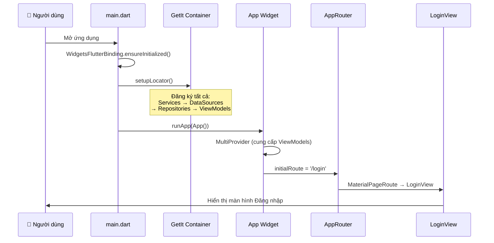

### Luồng xác thực (Authentication Flow)

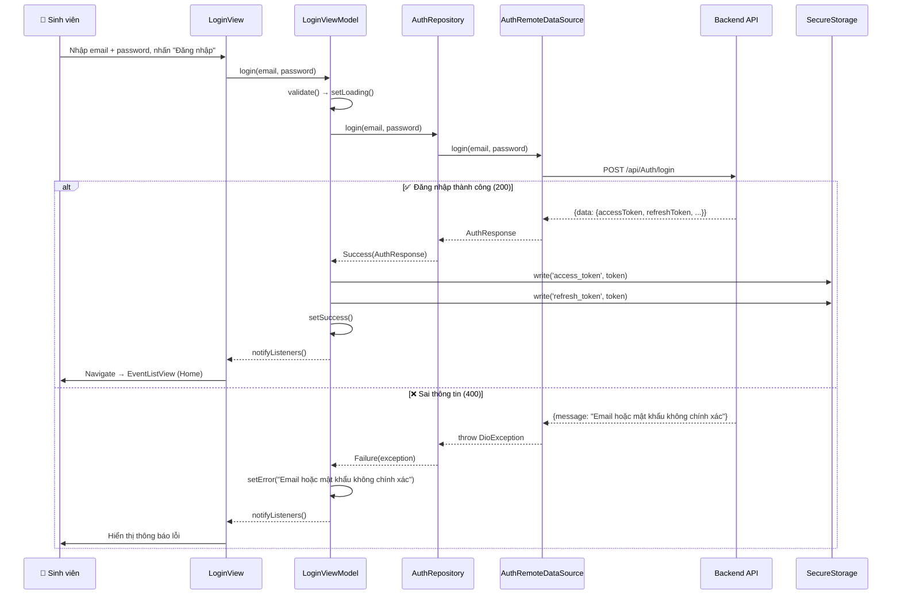

### Cơ chế tự động Refresh Token

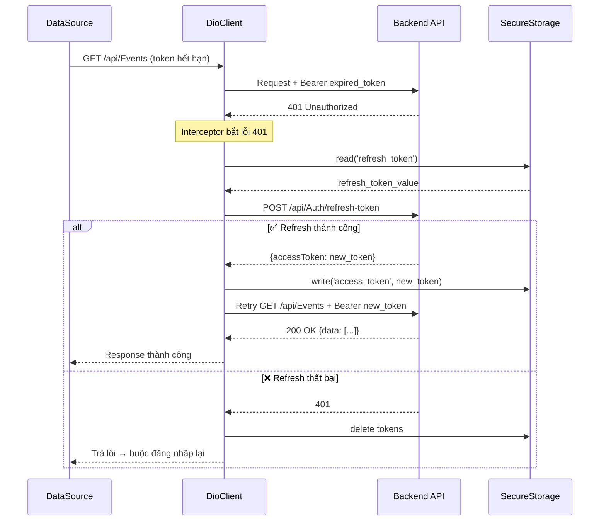

---

## 👨‍🎓 Luồng Người Dùng (Sinh Viên)

### Tổng quan luồng chính

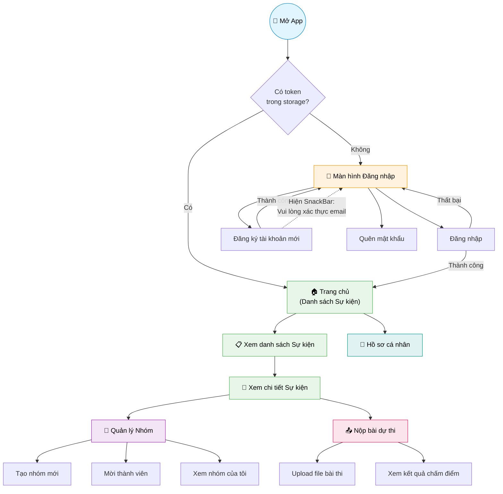

### Luồng 1: Đăng ký tài khoản

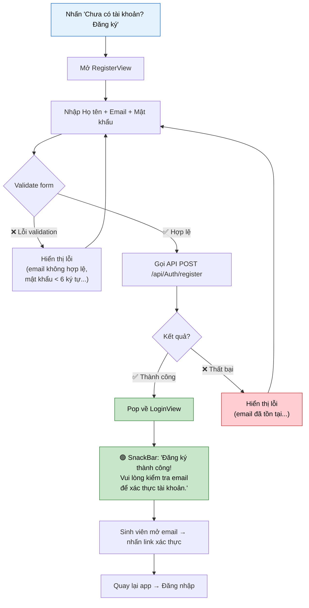

### Luồng 2: Đăng nhập

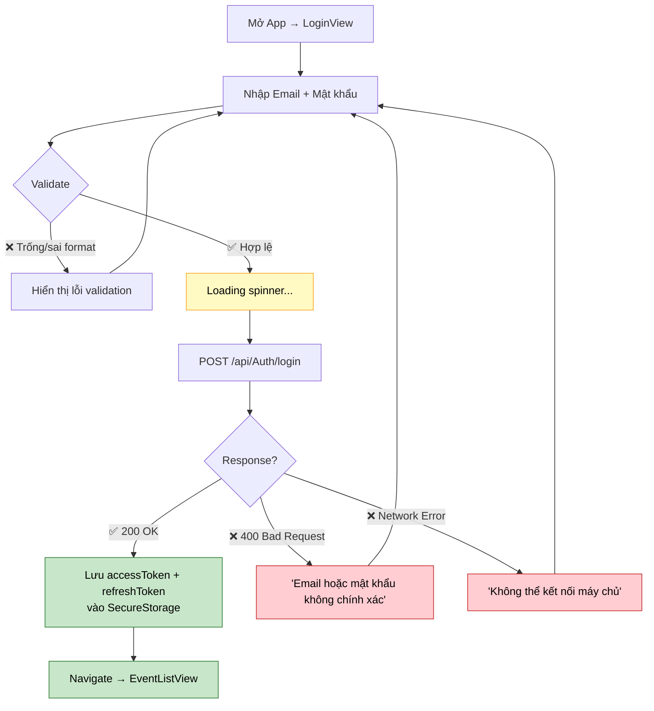

### Luồng 3: Xem & Tham gia Sự kiện

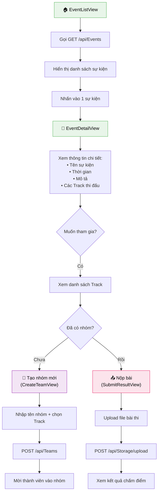

### Luồng 4: Quản lý Nhóm

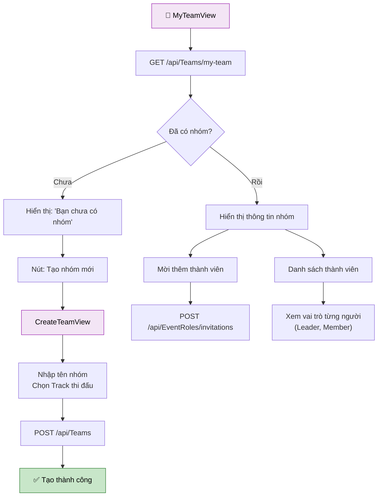

### Luồng 5: Nộp bài & Xem kết quả

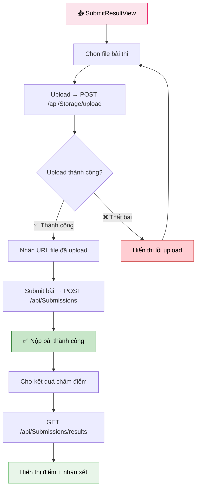

---

## 🚀 Cài Đặt & Chạy Dự Án

### Yêu cầu hệ thống

- **Flutter SDK** ≥ 3.12.2
- **Dart SDK** ≥ 3.12.2
- **Android Studio** / **VS Code** với Flutter plugin
- **Android SDK** ≥ 37 (cho `flutter_secure_storage`)
- **Git**

### Các bước cài đặt

```bash
# 1. Clone repository
git clone <repository-url>
cd seal-mobile

# 2. Cài đặt dependencies
flutter pub get

# 3. Chạy ứng dụng (debug mode)
flutter run

# 4. Build APK (production)
flutter build apk --release
```

### Cấu hình Backend URL

Mở file `lib/core/constants/api_endpoints.dart` và cập nhật `baseUrl`:

```dart
class ApiEndpoints {
  static const String baseUrl = 'https://api.sealswp391.xyz/';
  // ...
}
```

---

## 📄 License

Dự án này được phát triển cho môn học **PRM392** tại trường **FPT University**.
