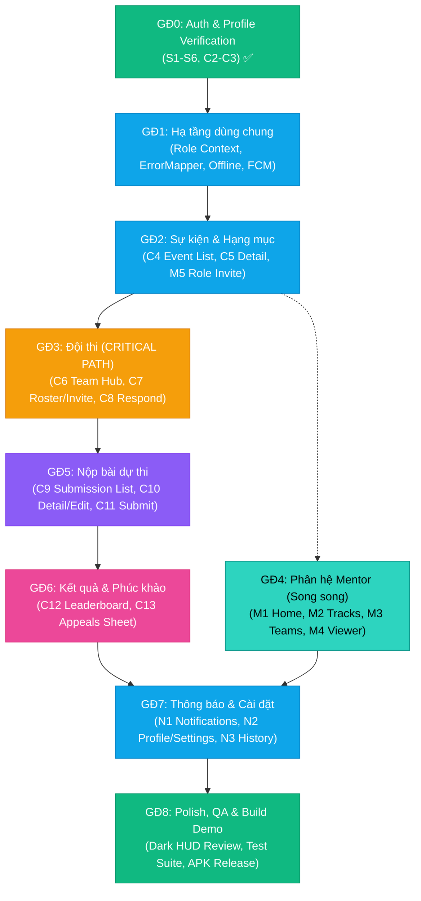
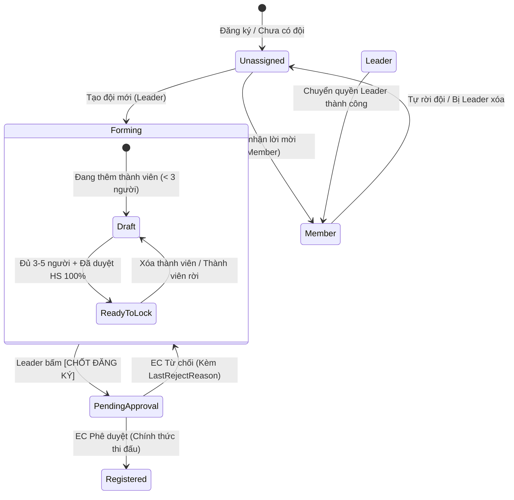

# 🦭 SEAL Mobile — Lộ trình Hoàn thiện & Triển khai Toàn diện (Master Execution Roadmap)

> **Dự án**: SEAL Mobile (Student Event Activity Lifecycle)  
> **Framework**: Flutter (SDK ≥ 3.12.2) & Dart (≥ 3.12.2)  
> **Kiến trúc**: MVVM + Repository Pattern + Provider + GetIt Service Locator  
> **Design System**: "Command Deck, Pocket Edition" (Dark Navy HUD, Hexagon Grid, Cyan Accent `#00d9ff`, Clipped Corners)  
> **Tài liệu đối chiếu**: `AGENT.md`, `TONG_QUAN_5_LUONG_SEAL.md`, `SEAL_mobile_wireframe_prompts.md`, `seal_mobile_api_trace.xlsx`

---

## 📑 Mục lục Master Roadmap

1. [Nguyên tắc Vận hành & Cây Phụ thuộc Dữ liệu (Data Dependency Graph)](#1-nguyên-tắc-vận-hành--cây-phụ-thuộc-dữ-liệu-data-dependency-graph)
2. [Chi tiết 9 Giai đoạn Triển khai (Giai đoạn 0 → Giai đoạn 8)](#2-chi-tiết-9-giai-đoạn-triển-khai-giai-đoạn-0--giai-đoạn-8)
   - [Giai đoạn 0 — Auth & Onboarding ✅ ĐÃ XONG](#giai-đoạn-0--auth--onboarding--đã-xong)
   - [Giai đoạn 1 — Hạ tầng dùng chung (Shared Infrastructure)](#giai-đoạn-1--hạ-tầng-dùng-chung-shared-infrastructure)
   - [Giai đoạn 2 — Sự kiện & Cấu hình (Events & Tracks)](#giai-đoạn-2--sự-kiện--cấu-hình-events--tracks)
   - [Giai đoạn 3 — Đội thi (Team Management — CRITICAL PATH)](#giai-đoạn-3--đội-thi-team-management--critical-path)
   - [Giai đoạn 4 — Phân hệ Cố vấn (Mentor Module — Chạy song song)](#giai-đoạn-4--phân-hệ-cố-vấn-mentor-module--chạy-song-song)
   - [Giai đoạn 5 — Nộp bài dự thi (Submission Flow)](#giai-đoạn-5--nộp-bài-dự-thi-submission-flow)
   - [Giai đoạn 6 — Kết quả, Bảng xếp hạng & Phúc khảo (Results, Leaderboard & Appeals)](#giai-đoạn-6--kết-quả-bảng-xếp-hạng--phúc-khảo-results-leaderboard--appeals)
   - [Giai đoạn 7 — Thông báo, Hồ sơ cá nhân & Lịch sử từ chối (Notifications & Profile)](#giai-đoạn-7--thông-báo-hồ-sơ-cá-nhân--lịch-sử-từ-chối-notifications--profile)
   - [Giai đoạn 8 — Tối ưu hóa UI/UX, QA & Đóng gói Demo (Polish & QA)](#giai-đoạn-8--tối-ưu-hóa-uiux-qa--đóng-gói-demo-polish--qa)
3. [Thiết kế Kỹ thuật Chi tiết: Skeletons & State Machines](#3-thiết-kế-kỹ-thuật-chi-tiết-skeletons--state-machines)
   - [3.1 Máy trạng thái Đội thi (Team State Machine)](#31-máy-trạng-thái-đội-thi-team-state-machine)
   - [3.2 TeamViewModel & TeamRepository Skeleton Code](#32-teamviewmodel--teamrepository-skeleton-code)
   - [3.3 SubmissionViewModel & AppealsViewModel Skeletons](#33-submissionviewmodel--appealsviewmodel-skeletons)
4. [Bộ Test Case & QA Checklist Chuẩn Module 11 (Taskly Standard)](#4-bộ-test-case--qa-checklist-chuẩn-module-11-taskly-standard)
   - [4.1 Unit Test Suite (ViewModel & Repository)](#41-unit-test-suite-viewmodel--repository)
   - [4.2 Widget Test Suite (HUD Components & Views)](#42-widget-test-suite-hud-components--views)
   - [4.3 Integration / E2E Test Flows](#43-integration--e2e-test-flows)
5. [Ma trận 27 Màn hình Toàn diện (S1–S6, C1–C13, M1–M5, N1–N3)](#5-ma-trận-27-màn-hình-toàn-diện-s1s6-c1c13-m1m5-n1n3)
6. [Ma trận Phòng thủ Mobile trước các Lỗi Backend (P0/P1 Defense Matrix)](#6-ma-trận-phòng-thủ-mobile-trước-các-lỗi-backend-p0p1-defense-matrix)
7. [Kế hoạch Phân bổ Sprint & Timeline Thực thi (1 Dev / 2 Devs / 5 Devs)](#7-kế-hoạch-phân-bổ-sprint--timeline-thực-thi-1-dev--2-devs--5-devs)
8. [Checklist Nghiệm thu 100% Dự án (Interactive Verification Checklist)](#8-checklist-nghiệm-thu-100-dự-án-interactive-verification-checklist)

---

## 1. Nguyên tắc Vận hành & Cây Phụ thuộc Dữ liệu (Data Dependency Graph)

### 1.1 Nguyên tắc cốt lõi
1. **Dependency-First Execution**: Không xếp việc theo cảm tính "màn nào dễ làm trước", mà đi theo **dòng chảy thực tế của dữ liệu (Data Pipeline)**:
   - Dữ liệu `User` đã duyệt → Tạo `Team` (`Forming`).
   - `Team` đủ 3–5 thành viên + chốt → EC duyệt thành `Registered`.
   - Chỉ khi có `Team` ở trạng thái `Registered` thì mới có thể mở `Submission` theo `Track`.
   - Chỉ khi hết hạn nộp bài và có `Submission` thì `Judge` mới có bài để chấm (`Score`).
   - Chỉ khi `Score` được tính toán (`FinalResult` được tạo và công bố) thì `Leaderboard` (C12) và `Appeals` (C13) mới có dữ liệu thật để kiểm thử.
2. **Tuân thủ Tuyệt đối Kiến trúc MVVM + Repository**:
   - `View` chỉ nhận sự kiện và hiển thị từ `ViewModel` (`Consumer<VM>`).
   - `ViewModel` kế thừa `BaseViewModel`, quản lý `ViewState` (`idle`, `loading`, `success`, `error`), không gọi trực tiếp HTTP client.
   - `Repository` bọc kết quả trả về bằng `ApiResult<T>` (`Success<T>` hoặc `Failure<T>`), xử lý `try/catch`.
   - `RemoteDataSource` sử dụng `DioClient` để request và deserialize JSON sang DTO Models.
3. **Phòng thủ Chủ động tại Frontend (Defensive Mobile Engineering)**:
   - Không phụ thuộc vào giả định Backend luôn validate đúng.
   - Luôn kiểm tra điều kiện biên (null safety, rỗng list, mạng mất kết nối, token hết hạn, xung đột thời gian).



---

## 2. Chi tiết 9 Giai đoạn Triển khai (Giai đoạn 0 → Giai đoạn 8)

### Giai đoạn 0 — Auth & Onboarding ✅ ĐÃ XONG
Checklist đối chiếu hoàn tất 100%:
- [x] **S1 Splash**: Điều hướng tự động theo phiên đăng nhập (Contestant → C1 / Mentor → M1 / 2 roles → S6 / Chưa login → S2).
- [x] **S2 Login**: Hỗ trợ Email/Password & Google Sign-In (`google_sign_in` 6.2.2). Banner toast kích hoạt email động.
- [x] **S3 Register**: Tạo tài khoản công khai (`POST /api/Auth/register`) + Auto-redirect về S2 kèm thông báo kiểm tra email.
- [x] **S4 Verification State**: Xử lý Deep Link kích hoạt email qua Gmail (`/verify-email?token=...`), chuyển trạng thái banner S2 sang xanh lá.
- [x] **S5 Forgot & Reset Password**: Quy trình 2 bước: Nhận mã reset qua email + Đặt lại mật khẩu mới.
- [x] **S6 Onboarding Role Check**: Phân luồng cho người dùng kiêm nhiệm 2 vai trò (`Contestant` / `Mentor`).
- [x] **C2 Profile Verification**: Phân loại 2 nhánh: Sinh viên FPT (Mock API auto-approve) và Sinh viên ngoài FPT (Upload ảnh thẻ sinh viên qua `StorageRemoteDataSource`, chờ duyệt tay).
- [x] **C3 Profile Locked**: Màn hình chặn toàn diện khi tài khoản bị từ chối ≥2 lần (`UserRejections`), hỗ trợ gửi yêu cầu gỡ khóa `[REQUEST UNBLOCK]`.

---

### Giai đoạn 1 — Hạ tầng dùng chung (Shared Infrastructure)
Nền tảng cốt lõi được khởi tạo một lần và tái sử dụng cho toàn bộ các màn hình tiếp theo:

| Thành phần | File & Vị trí | Mục đích & Chi tiết triển khai | Độ phức tạp |
|---|---|---|:---:|
| `UserRoleContext` Singleton | `lib/core/context/user_role_context.dart` | Quản lý vai trò hiện hành (`contestant` hoặc `mentor`). Điều phối giao diện Shell Tab Bar tương ứng. | **M** |
| `ErrorMapper` tập trung | `lib/core/utils/error_mapper.dart` | Chuyển đổi mã lỗi Backend (400, 401, 403, 404, 500, network error) thành thông điệp tiếng Việt thân thiện, rõ nghĩa. | **S** |
| Push & Local Notifications | `lib/core/services/notification_service.dart` | Tích hợp Firebase Cloud Messaging (FCM) + `flutter_local_notifications`. Quản lý huy hiệu số lượng tin chưa đọc (Unread badge count). | **L** |
| Generic Deep Link Handler | `lib/app/router/deep_link_handler.dart` | Xử lý điều hướng trực tiếp từ link email: Lời mời vào đội (`seal://team/invite?id=...`), Lời mời Mentor Track, Thông báo kết quả vòng thi. | **M** |
| Global Offline & Connectivity State | `lib/core/network/network_info.dart` | Lắng nghe trạng thái mạng (`connectivity_plus`). Hiển thị HUD Offline Bar và hỗ trợ kéo để tải lại khi có mạng trở lại. | **M** |
| Multi-part Image Upload Helper | `lib/data/services/storage_remote_datasource.dart` | Helper upload ảnh chụp/file lên `POST /api/Storage/upload`, trả về URL ảnh CDN dùng cho C2 Profile, C13 Appeals và N2 Avatar. | **S** |

---

### Giai đoạn 2 — Sự kiện & Cấu hình (Events & Tracks)
Cung cấp dữ liệu gốc về cuộc thi, vòng thi (`Round`) và hạng mục thi đấu (`Track`):

- **Màn hình triển khai**:
  - `C4 Event List` (`lib/ui/event/views/event_list_view.dart`): Danh sách sự kiện, bộ lọc theo trạng thái (`Upcoming`, `Ongoing`, `Closed`), thanh tìm kiếm thời gian thực.
  - `C5 Event Detail` (`lib/ui/event/views/event_detail_view.dart`): 3 Tab nội dung: **Luật chơi** (Rules), **Lộ trình** (Timeline/Rounds), **Hạng mục** (Tracks). Nút CTA neo đáy: `[ TẠO ĐỘI ]` hoặc `[ VÀO ĐỘI ]`.
  - `M5 Role Invitation Response` (`lib/ui/mentor/views/role_invitation_sheet.dart`): Bottom Sheet phản hồi lời mời làm Mentor cho Track (`Accept` / `Decline`).
- **API Endpoints tương tác**:
  - `GET /api/Events` — Lấy danh sách sự kiện mở.
  - `GET /api/Events/{id}` — Lấy chi tiết sự kiện kèm danh sách Vòng thi (`Rounds`).
  - `GET /api/Tracks?eventId={id}` — Lấy danh sách Track thuộc sự kiện.
  - `POST /api/EventRoles/invitations/{id}/respond` — Mentor chấp nhận/từ chối lời mời.

---

### Giai đoạn 3 — Đội thi (Team Management — CRITICAL PATH)
> ⚠️ **ĐÂY LÀ VÙNG TRỌNG YẾU (CRITICAL PATH) VÀ PHỨC TẠP NHẤT DỰ ÁN**. Mọi tính năng Nộp bài (C9-C11), Bảng xếp hạng (C12) và Phúc khảo (C13) đều phụ thuộc vào một Đội thi đã được duyệt (`Registered`).

- **Màn hình triển khai**:
  - `C6 My Team Hub` (`lib/ui/team/views/my_team_view.dart`): Quản lý 3 trạng thái của người dùng:
    1. **Unassigned**: Chưa có đội → Hiển thị 2 CTA lớn `[ TẠO ĐỘI MỚI ]` / `[ TÌM & GIA NHẬP ĐỘI ]`.
    2. **Member**: Đã vào đội với tư cách thành viên → Xem danh sách đồng đội, nút `[ RỜI ĐỘI ]` (kèm dialog xác nhận).
    3. **Leader**: Trưởng nhóm → Quản trị thành viên, xem Banner cảnh báo từ chối (`LastRejectReason`), nút `[ CHỐT ĐĂNG KÝ ]` (kiểm tra điều kiện: đủ 3–5 thành viên & 100% thành viên đã được duyệt hồ sơ sinh viên).
  - `C7 Team Roster & Invite` (`lib/ui/team/views/team_roster_view.dart`):
    - Danh sách thẻ thành viên với trạng thái xác minh hồ sơ.
    - Chức năng xóa thành viên (Delete/Swipe-to-remove).
    - Bottom Sheet mời thành viên qua email (`POST /api/Teams/invite`).
    - Nút `[ CHUYỂN QUYỀN TRƯỞNG NHÓM ]`: Khởi tạo yêu cầu chuyển quyền, hiển thị đồng hồ đếm ngược 24 giờ tính từ `ExpiresAt` của Server.
  - `C8 Team Invitation Response` (`lib/ui/team/widgets/team_invitation_bottom_sheet.dart`): Bottom Sheet cho người dùng nhận lời mời gia nhập hoặc nhận bàn giao quyền trưởng nhóm.
- **API Endpoints tương tác**:
  - `POST /api/Teams` — Tạo đội thi mới (người tạo mặc định thành `Leader`, trạng thái `Forming`).
  - `GET /api/Teams/my-team` — Lấy thông tin đội hiện tại của sinh viên.
  - `POST /api/Teams/{id}/members/invite` — Mời thành viên bằng email.
  - `POST /api/Teams/invitations/{id}/respond` — Đồng ý / từ chối lời mời vào đội (`Accept` / `Reject`).
  - `DELETE /api/Teams/{id}/members/{userId}` — Trưởng nhóm xóa thành viên khỏi đội.
  - `POST /api/Teams/{id}/leave` — Thành viên tự rời đội.
  - `POST /api/Teams/{id}/transfer-leader` — Bàn giao quyền trưởng nhóm cho thành viên khác.
  - `POST /api/Teams/{id}/confirm-registration` — Trưởng nhóm chốt đăng ký đội thi (chuyển sang `PendingApproval`, chờ EC duyệt).

---

### Giai đoạn 4 — Phân hệ Cố vấn (Mentor Module — Chạy song song)
> Phân hệ Mentor hoàn toàn độc lập với State Machine của Team, có thể triển khai song song với Giai đoạn 3.

- **Màn hình triển khai**:
  - `M1 Mentor Home` (`lib/ui/mentor/views/mentor_home_view.dart`): Bento cards tổng quan: Số Track được phân công, số đội cần chú ý (sắp tới hạn nộp mà chưa nộp bài).
  - `M2 My Tracks` (`lib/ui/mentor/views/my_tracks_view.dart`): Danh sách các Hạng mục mà Mentor phụ trách.
  - `M3 Teams in Track` (`lib/ui/mentor/views/teams_in_track_view.dart`): Danh sách các đội thi trong Track, avatar stack thành viên, trạng thái nộp bài.
  - `M4 Team / Submission Viewer` (`lib/ui/mentor/views/team_viewer_view.dart`): Chế độ xem thông tin đội và link bài dự thi.
  - 🔒 **Ranh giới bất khả xâm phạm**: Phân hệ Mentor **100% Read-Only**. Tuyệt đối không hiển thị bất kỳ nút bấm hay affordance nào liên quan đến sửa thông tin hoặc chấm điểm (kể cả nút ở trạng thái `disabled`).

---

### Giai đoạn 5 — Nộp bài dự thi (Submission Flow)
Chỉ thực hiện sau khi đã có Đội thi ở trạng thái `Registered`:

- **Màn hình triển khai**:
  - `C9 Submission List` (`lib/ui/submission/views/submission_list_view.dart`): Danh sách bài nộp **theo từng Track** (không gộp theo Round), hiển thị badge trạng thái (`Chưa nộp`, `Đã nộp`, `Đã chấm`) và chip đếm ngược deadline.
  - `C10 Submission Detail / Edit` (`lib/ui/submission/views/submission_detail_view.dart`): Xem chi tiết link repo/demo, cập nhật bài nộp hoặc xóa bài nộp. Tự động khóa toàn bộ trường nhập khi quá hạn nộp bài hoặc khi Vòng thi đã bắt đầu chấm (`FinalResult` tồn tại).
  - `C11 Submit New Entry` (`lib/ui/submission/views/submit_entry_view.dart`): Form nộp bài lần đầu: Chọn Track, nhập URL GitHub / Demo / Slide (validate regex định dạng URL), nhập mô tả tóm tắt.
- **API Endpoints tương tác**:
  - `GET /api/SubmitResults?teamId={id}` — Lấy danh sách bài nộp của đội.
  - `POST /api/SubmitResults` — Nộp bài dự thi mới cho Track.
  - `PUT /api/SubmitResults/{id}` — Cập nhật bài dự thi (khi còn trong hạn nộp).
  - `DELETE /api/SubmitResults/{id}` — Xóa bài nộp để nộp lại.

---

### Giai đoạn 6 — Kết quả, Bảng xếp hạng & Phúc khảo (Results, Leaderboard & Appeals)
Thực hiện sau khi Ban giám khảo đã có điểm chấm và EC đã công bố kết quả Vòng thi:

- **Màn hình triển khai**:
  - `C12 Leaderboard` (`lib/ui/leaderboard/views/leaderboard_view.dart`):
    - **Podium dọc** chuẩn Mobile cho Top 3 (Rank 1 hiển thị nổi bật trên cùng với hiệu ứng Cyan Glow).
    - Danh sách thẻ thứ hạng cho các đội còn lại: Thứ hạng (Mono font), Tên đội, Điểm số trung bình, Chỉ số biến động thứ hạng (▲/▼).
    - **Score Detail Bottom Sheet**: Chạm vào đội để mở bảng điểm chi tiết theo từng tiêu chí trong Template (Read-only).
  - `C13 Appeals` (`lib/ui/appeals/views/appeals_view.dart`):
    - Danh sách các đơn phúc khảo đội đã gửi (Status: `Pending`, `Approved`, `Rejected`).
    - Bottom Sheet tạo đơn phúc khảo: Chọn bài nộp cần phúc khảo, nhập lý do chi tiết, đính kèm ảnh bằng chứng (tùy chọn, upload qua `StorageRemoteDataSource`).
- **API Endpoints tương tác**:
  - `GET /api/FinalResults/round/{roundId}` — Lấy bảng xếp hạng điểm của Vòng thi đã công bố.
  - `GET /api/Scores/team/{teamId}` — Lấy chi tiết điểm số từng tiêu chí.
  - `GET /api/Appeals/my-team` — Lấy danh sách đơn phúc khảo của đội.
  - `POST /api/Appeals` — Gửi đơn phúc khảo mới.

---

### Giai đoạn 7 — Thông báo, Hồ sơ cá nhân & Lịch sử từ chối (Notifications & Profile)
Hoàn thiện toàn bộ các luồng phụ trợ:

- **Màn hình triển khai**:
  - `N1 Notifications Center` (`lib/ui/notifications/views/notifications_view.dart`): Trung tâm thông báo tập trung mọi sự kiện (Lời mời đội, Lời mời Mentor, Nhắc nhở hạn nộp bài, Kết quả công bố, Kết quả phúc khảo). Hỗ trợ vuốt đánh dấu đã đọc và xóa thông báo.
  - `N2 Profile & Settings` (`lib/ui/profile/views/profile_view.dart`): Cập nhật thông tin cá nhân, thay đổi ảnh đại diện, đổi mật khẩu, công tắc chuyển đổi ngôn ngữ EN / VI, nút `[ ĐĂNG XUẤT ]`.
  - `N3 Rejection History` (`lib/ui/profile/views/rejection_history_view.dart`): Danh sách lịch sử các lần bị từ chối hồ sơ kèm lý do phản hồi chi tiết từ Ban tổ chức (dành riêng cho Contestant).

---

### Giai đoạn 8 — Tối ưu hóa UI/UX, QA & Đóng gói Demo (Polish & QA)
- **Rà soát toàn diện Design System & Accessibility**:
  - Kiểm tra chuẩn màu Dark Navy HUD (`#070b14`), Cyan Accent (`#00d9ff`), Clipped Corner 8px.
  - Đảm bảo toàn bộ Tap Target ≥ 44×44pt và cỡ chữ không nhỏ hơn 13px.
  - Kiểm tra trạng thái Offline trên toàn bộ 27 màn hình.
- **Chạy toàn bộ Test Suite (Unit + Widget + Integration)**.
- **Đóng gói ứng dụng**: Build file APK / App Bundle chuẩn bị cho buổi báo cáo, demo đồ án.

---

## 3. Thiết kế Kỹ thuật Chi tiết: Skeletons & State Machines

### 3.1 Máy trạng thái Đội thi (Team State Machine)



---

### 3.2 TeamViewModel & TeamRepository Skeleton Code

#### `TeamRepository` (`lib/data/repositories/team_repository.dart`)
```dart
import '../../core/network/api_result.dart';
import '../models/team/team_model.dart';
import '../models/team/team_invitation_model.dart';
import '../services/team_remote_datasource.dart';

class TeamRepository {
  final TeamRemoteDataSource _dataSource;
  const TeamRepository(this._dataSource);

  Future<ApiResult<TeamModel?>> getMyTeam() async {
    try {
      final team = await _dataSource.getMyTeam();
      return ApiResult.success(team);
    } catch (e) {
      return ApiResult.failure(e.toString());
    }
  }

  Future<ApiResult<TeamModel>> createTeam({
    required String name,
    required String eventId,
    String? description,
  }) async {
    try {
      final team = await _dataSource.createTeam(
        name: name,
        eventId: eventId,
        description: description,
      );
      return ApiResult.success(team);
    } catch (e) {
      return ApiResult.failure(e.toString());
    }
  }

  Future<ApiResult<void>> inviteMember(String teamId, String email) async {
    try {
      await _dataSource.inviteMember(teamId, email);
      return const ApiResult.success(null);
    } catch (e) {
      return ApiResult.failure(e.toString());
    }
  }

  Future<ApiResult<void>> removeMember(String teamId, String userId) async {
    try {
      await _dataSource.removeMember(teamId, userId);
      return const ApiResult.success(null);
    } catch (e) {
      return ApiResult.failure(e.toString());
    }
  }

  Future<ApiResult<void>> leaveTeam(String teamId) async {
    try {
      await _dataSource.leaveTeam(teamId);
      return const ApiResult.success(null);
    } catch (e) {
      return ApiResult.failure(e.toString());
    }
  }

  Future<ApiResult<void>> confirmRegistration(String teamId) async {
    try {
      await _dataSource.confirmRegistration(teamId);
      return const ApiResult.success(null);
    } catch (e) {
      return ApiResult.failure(e.toString());
    }
  }

  Future<ApiResult<void>> transferLeadership(String teamId, String newLeaderId) async {
    try {
      await _dataSource.transferLeadership(teamId, newLeaderId);
      return const ApiResult.success(null);
    } catch (e) {
      return ApiResult.failure(e.toString());
    }
  }

  Future<ApiResult<void>> respondInvitation(String invitationId, bool accept) async {
    try {
      await _dataSource.respondInvitation(invitationId, accept);
      return const ApiResult.success(null);
    } catch (e) {
      return ApiResult.failure(e.toString());
    }
  }
}
```

#### `TeamViewModel` (`lib/ui/team/viewmodels/team_viewmodel.dart`)
```dart
import '../../../core/base/base_viewmodel.dart';
import '../../../core/context/user_role_context.dart';
import '../../../data/models/team/team_model.dart';
import '../../../data/models/team/team_member_model.dart';
import '../../../data/repositories/team_repository.dart';

enum TeamUserState { unassigned, member, leader }

class TeamViewModel extends BaseViewModel {
  final TeamRepository _teamRepository;
  final UserRoleContext _userContext;

  TeamViewModel(this._teamRepository, this._userContext);

  TeamModel? _myTeam;
  TeamModel? get myTeam => _myTeam;

  TeamUserState get userState {
    if (_myTeam == null) return TeamUserState.unassigned;
    final currentUserId = _userContext.currentUserId;
    if (_myTeam!.leaderId == currentUserId) return TeamUserState.leader;
    return TeamUserState.member;
  }

  bool get canConfirmRegistration {
    if (_myTeam == null || userState != TeamUserState.leader) return false;
    final members = _myTeam!.members;
    if (members.length < 3 || members.length > 5) return false;
    // Kiểm tra tất cả thành viên đã được duyệt hồ sơ sinh viên
    return members.every((m) => m.isVerified == true);
  }

  String? get lastRejectReason => _myTeam?.status == 'Rejected' ? _myTeam?.description : null;

  Future<void> loadMyTeam() async {
    setLoading();
    final result = await _teamRepository.getMyTeam();
    result.when(
      success: (data) {
        _myTeam = data;
        setSuccess();
      },
      failure: (error) {
        setError(error);
      },
    );
  }

  Future<bool> createTeam(String name, String eventId, {String? description}) async {
    setLoading();
    final result = await _teamRepository.createTeam(
      name: name,
      eventId: eventId,
      description: description,
    );
    return result.when(
      success: (data) {
        _myTeam = data;
        setSuccess();
        return true;
      },
      failure: (error) {
        setError(error);
        return false;
      },
    );
  }

  Future<bool> confirmRegistration() async {
    if (_myTeam == null || !canConfirmRegistration) return false;
    setLoading();
    final result = await _teamRepository.confirmRegistration(_myTeam!.id);
    return result.when(
      success: (_) {
        loadMyTeam();
        return true;
      },
      failure: (error) {
        setError(error);
        return false;
      },
    );
  }

  Future<bool> inviteMember(String email) async {
    if (_myTeam == null) return false;
    setLoading();
    final result = await _teamRepository.inviteMember(_myTeam!.id, email);
    return result.when(
      success: (_) {
        loadMyTeam();
        return true;
      },
      failure: (error) {
        setError(error);
        return false;
      },
    );
  }

  Future<bool> removeMember(String userId) async {
    if (_myTeam == null) return false;
    setLoading();
    final result = await _teamRepository.removeMember(_myTeam!.id, userId);
    return result.when(
      success: (_) {
        loadMyTeam();
        return true;
      },
      failure: (error) {
        setError(error);
        return false;
      },
    );
  }

  Future<bool> leaveTeam() async {
    if (_myTeam == null) return false;
    setLoading();
    final result = await _teamRepository.leaveTeam(_myTeam!.id);
    return result.when(
      success: (_) {
        _myTeam = null;
        setSuccess();
        return true;
      },
      failure: (error) {
        setError(error);
        return false;
      },
    );
  }
}
```

---

### 3.3 SubmissionViewModel & AppealsViewModel Skeletons

#### `SubmissionViewModel` (`lib/ui/submission/viewmodels/submission_viewmodel.dart`)
```dart
import '../../../core/base/base_viewmodel.dart';
import '../../../data/models/submission/submit_result_model.dart';
import '../../../data/repositories/submission_repository.dart';

class SubmissionViewModel extends BaseViewModel {
  final SubmissionRepository _submissionRepository;
  SubmissionViewModel(this._submissionRepository);

  List<SubmitResultModel> _submissions = [];
  List<SubmitResultModel> get submissions => _submissions;

  Future<void> loadSubmissions(String teamId) async {
    setLoading();
    final result = await _submissionRepository.getSubmissions(teamId);
    result.when(
      success: (data) {
        _submissions = data;
        setSuccess();
      },
      failure: (error) => setError(error),
    );
  }

  Future<bool> submitEntry({
    required String trackId,
    required String teamId,
    required String projectUrl,
    String? description,
  }) async {
    setLoading();
    final result = await _submissionRepository.submitResult(
      trackId: trackId,
      teamId: teamId,
      projectUrl: projectUrl,
      description: description,
    );
    return result.when(
      success: (data) {
        _submissions.add(data);
        setSuccess();
        return true;
      },
      failure: (error) {
        setError(error);
        return false;
      },
    );
  }
}
```

---

## 4. Bộ Test Case & QA Checklist Chuẩn Module 11 (Taskly Standard)

### 4.1 Unit Test Suite (ViewModel & Repository)
Tạo tại thư mục `test/unit/`:

1. **`team_viewmodel_test.dart`**:
   - `test`: Trạng thái ban đầu khi chưa có đội phải là `TeamUserState.unassigned`.
   - `test`: Khi User ID trùng với `leaderId` của đội → `userState` chuyển sang `TeamUserState.leader`.
   - `test`: Khi số thành viên < 3 → `canConfirmRegistration` trả về `false`.
   - `test`: Khi đủ 3 thành viên nhưng có 1 thành viên `isVerified == false` → `canConfirmRegistration` trả về `false`.
   - `test`: Khi đủ 3-5 thành viên và tất cả đã verify → `canConfirmRegistration` trả về `true`.
   - `test`: Đội bị từ chối (`status == 'Rejected'`) → `lastRejectReason` trả về đúng chuỗi lý do từ Backend.
   - `test`: Bàn giao quyền Leader kích hoạt đếm ngược 24h và tính lại thời gian còn lại chính xác khi mở lại ứng dụng từ `ExpiresAt`.

2. **`auth_repository_test.dart`**:
   - `test`: Đăng nhập thành công lưu token vào `FlutterSecureStorage` và cập nhật `UserRoleContext`.
   - `test`: Khi Refresh Token hết hạn (401) → Tự động logout và điều hướng về màn hình Login (S2).

3. **`submission_viewmodel_test.dart`**:
   - `test`: Kiểm tra validate URL regex (bắt buộc đúng định dạng `https://github.com/...` hoặc `https://...`).
   - `test`: Khi `FinalResult` đã được tính toán cho Round → Khóa khả năng nộp/sửa bài.

---

### 4.2 Widget Test Suite (HUD Components & Views)
Tạo tại thư mục `test/widget/`:

1. **`hud_card_test.dart`**: Kiểm tra Render đúng đường viền vát góc (Clipped Corner 8px) và dải màu Accent ở cạnh trái theo vai trò (`sky-blue` cho Contestant, `teal` cho Mentor).
2. **`my_team_view_test.dart`**: Kiểm tra hiển thị đúng nút `[CHỐT ĐĂNG KÝ]` ở trạng thái `disabled` khi điều kiện chưa thỏa mãn và hiển thị SnackBar cảnh báo.
3. **`leaderboard_view_test.dart`**: Kiểm tra Podium Top 3 hiển thị đúng thứ tự dọc và chạm vào dòng mở đúng `ScoreDetailSheet`.

---

### 4.3 Integration / E2E Test Flows
Kịch bản kiểm thử tích hợp xuyên suốt toàn hệ thống:
1. **Flow A (Đăng ký → Duyệt SV → Tạo đội → Chốt duyệt)**:
   - S3 Đăng ký → S2 Đăng nhập → C2 Duyệt SV FPT → C1 Home → C6 Tạo đội → C7 Mời 2 thành viên → Chấp nhận lời mời → C6 Chốt đăng ký.
2. **Flow B (Nộp bài → Xem kết quả → Phúc khảo)**:
   - C9 Mở Track → C11 Nhập URL nộp bài → C10 Xem bài nộp → C12 Xem bảng xếp hạng công bố → Mở bảng điểm tiêu chí → C13 Tạo đơn phúc khảo.

---

## 5. Ma trận 27 Màn hình Toàn diện (S1–S6, C1–C13, M1–M5, N1–N3)

| Mã | Tên màn hình | File View | File ViewModel | Route Name | API Endpoints Chính |
|:---:|---|---|---|---|---|
| **S1** | Splash Screen | `splash_view.dart` | `LoginViewModel` | `/splash` | Token check local |
| **S2** | Login | `login_view.dart` | `LoginViewModel` | `/login` | `POST /api/Auth/login`, `POST /api/Auth/google-login` |
| **S3** | Register | `register_view.dart` | `RegisterViewModel` | `/register` | `POST /api/Auth/register` |
| **S4** | Email Check State | (State trong `LoginView`) | `LoginViewModel` | `/login` | `POST /api/Auth/verify-email` |
| **S5** | Forgot/Reset Password | `forgot_password_view.dart` | `LoginViewModel` | `/forgot-password` | `POST /api/Auth/forgot-password`, `reset-password` |
| **S6** | Role Check Onboarding | `role_check_view.dart` | `UserRoleViewModel` | `/role-check` | `GET /api/EventRoles/user` |
| **C1** | Home (Contestant) | `home_view.dart` | `HomeViewModel` | `/home` | Aggregation API |
| **C2** | Profile Verification | `profile_verification_view.dart` | `ProfileViewModel` | `/profile-verification` | `POST /api/Auth/student-profiles`, `POST /api/Storage/upload` |
| **C3** | Profile Locked | `profile_locked_view.dart` | `ProfileViewModel` | `/profile-locked` | `POST /api/Auth/request-unblock` |
| **C4** | Event List | `event_list_view.dart` | `EventViewModel` | `/events` | `GET /api/Events` |
| **C5** | Event Detail | `event_detail_view.dart` | `EventViewModel` | `/event-detail` | `GET /api/Events/{id}`, `GET /api/Tracks` |
| **C6** | My Team Hub | `my_team_view.dart` | `TeamViewModel` | `/my-team` | `GET /api/Teams/my-team`, `POST /api/Teams/confirm-registration` |
| **C7** | Team Roster & Invite | `team_roster_view.dart` | `TeamViewModel` | `/team-roster` | `POST /api/Teams/{id}/members/invite`, `transfer-leader` |
| **C8** | Team Invite Response | `team_invitation_bottom_sheet.dart`| `TeamViewModel` | (Bottom Sheet) | `POST /api/Teams/invitations/{id}/respond` |
| **C9** | Submission List | `submission_list_view.dart` | `SubmissionViewModel` | `/submissions` | `GET /api/SubmitResults` |
| **C10**| Submission Detail/Edit | `submission_detail_view.dart` | `SubmissionViewModel` | `/submission-detail` | `PUT /api/SubmitResults/{id}`, `DELETE /api/SubmitResults/{id}` |
| **C11**| Submit New Entry | `submit_entry_view.dart` | `SubmissionViewModel` | `/submit-entry` | `POST /api/SubmitResults` |
| **C12**| Leaderboard | `leaderboard_view.dart` | `MentorRankingViewModel` | `/leaderboard` | `GET /api/FinalResults/round/{id}`, `GET /api/Scores/team` |
| **C13**| Appeals Center | `appeals_view.dart` | `AppealsViewModel` | `/appeals` | `GET /api/Appeals/my-team`, `POST /api/Appeals` |
| **M1** | Mentor Home | `mentor_home_view.dart` | `MentorDashboardViewModel`| `/mentor` | `GET /api/EventRoles/user`, `GET /api/Tracks` |
| **M2** | My Tracks | `my_tracks_view.dart` | `MentorViewModel` | `/my-tracks` | `GET /api/Tracks` |
| **M3** | Teams in Track | `teams_in_track_view.dart` | `MentorViewModel` | `/teams-in-track` | `GET /api/Teams?trackId={id}` |
| **M4** | Team/Submission Viewer| `team_viewer_view.dart` | `TeamScoreBreakdownViewModel` | `/team-viewer` | `GET /api/Teams/{id}`, `GET /api/SubmitResults` |
| **M5** | Mentor Invite Response| `role_invitation_sheet.dart`| `MentorViewModel` | (Bottom Sheet) | `POST /api/EventRoles/invitations/{id}/respond` |
| **N1** | Notifications Center | `notifications_view.dart` | `NotificationsViewModel` | `/notifications` | Local & Push Notification Stream |
| **N2** | Profile & Settings | `profile_view.dart` | `ProfileViewModel` | `/profile` | `GET /api/Users/profile`, `PUT /api/Users/profile` |
| **N3** | Rejection History | `rejection_history_view.dart` | `ProfileViewModel` | `/rejection-history`| `GET /api/UserRejections/my-rejections` |

---

## 6. Ma trận Phòng thủ Mobile trước các Lỗi Backend (P0/P1 Defense Matrix)

| Mã lỗi BE | Hiện tượng tại Backend | Hậu quả nếu không phòng thủ | Chiến lược Phòng thủ Chủ động tại Mobile FE |
|---|---|---|---|
| **BE-P0-01** | Chưa tách riêng BXH theo từng Track (chỉ tính gộp cả Round). | UI lọc theo Track sẽ bị rỗng hoặc trùng lặp điểm của cả Vòng thi. | Hiển thị thông báo rõ ràng: "Bảng xếp hạng đang được tính chung cho toàn Vòng thi". Không crash app khi trường `trackId` trả về null trong `FinalResult`. |
| **BE-P0-02** | Google Sign-in fail do sai `serverClientId`. | Người dùng đăng nhập bằng Google trên thiết bị thật bị crash hoặc treo vô tận. | Validate `serverClientId` đúng chuẩn Web Client ID trong `GoogleSignIn` config; bắt `catchError` và fallback sang thông báo đăng nhập thủ công. |
| **BE-P0-03** | Thiếu trường hợp "Trường học chưa có trong danh sách" khi đăng ký ngoài FPT. | Thí sinh ngoài FPT gặp ngõ cụt (dead-end) không thể hoàn thành C2. | Bổ sung option `"Khác / Trường chưa có trong danh sách"` tại Dropdown FE, tự động điền giá trị tùy biến khi gửi API. |
| **BE-P1-01** | Logic kiểm tra "Cấm gửi phúc khảo sau khi đã công bố giải" bị vô hiệu tại BE. | Mobile disable nút gửi đơn sai thời điểm khiến thí sinh không thể khiếu nại. | Không tự ý disable nút `[GỬI PHÚC KHẢO]` dựa trên giả định thời gian; luôn cho phép bấm gửi và bắt phản hồi trực tiếp từ API BE để hiển thị toast. |
| **BE-P1-02** | Mentor chấp nhận lời mời Track chặn nhầm kiêm nhiệm Judge Track khác. | Người dùng kiêm nhiệm 2 vai trò bị chặn không thể Accept ở M5. | Mobile hiển thị rõ thông báo lỗi nhận được từ API: "Không thể nhận lời mời do xung đột vai trò tại sự kiện" thay vì thông báo lỗi chung chung 500. |

---

## 7. Kế hoạch Phân bổ Sprint & Timeline Thực thi (1 Dev / 2 Devs / 5 Devs)

### 7.1 Phương án 1 Developer (Tuần tự chuẩn) — 4 Sprints (4 Tuần)
- **Sprint 1 (Tuần 1)**: Hoàn thiện GĐ1 (Hạ tầng `UserRoleContext`, `ErrorMapper`, FCM) + GĐ2 (Sự kiện C4, C5).
- **Sprint 2 (Tuần 2)**: Trọng tâm GĐ3 (Đội thi C6, C7, C8 — Hoàn tất State Machine & Unit Test).
- **Sprint 3 (Tuần 3)**: GĐ4 (Mentor M1–M5) + GĐ5 (Nộp bài C9–C11) + GĐ6 (Bảng xếp hạng C12 & Phúc khảo C13).
- **Sprint 4 (Tuần 4)**: GĐ7 (Thông báo N1, Cài đặt N2, Lịch sử N3) + GĐ8 (Polish Dark HUD, chạy trọn bộ Test Suite & Đóng gói APK).

### 7.2 Phương án 2 Developers (Chạy song song) — 2.5 Tuần
- **Dev 1 (Contestant & Team Core)**:
  - Tuần 1: GĐ1 Hạ tầng chung → GĐ3 Đội thi (C6, C7, C8).
  - Tuần 2: GĐ5 Nộp bài (C9, C10, C11) → GĐ6 Kết quả & Phúc khảo (C12, C13).
  - Nửa tuần cuối: Tích hợp E2E Test & Release.
- **Dev 2 (Events, Mentor & System)**:
  - Tuần 1: GĐ2 Sự kiện (C4, C5) → GĐ4 Phân hệ Mentor (M1, M2, M3, M4, M5).
  - Tuần 2: GĐ7 Thông báo & Cài đặt (N1, N2, N3) → GĐ8 Widget Test & Dark HUD Polish.
  - Nửa tuần cuối: Hỗ trợ kiểm thử tích hợp & Đóng gói demo.

### 7.3 Phương án 5 Developers (Theo 5 Luồng `TONG_QUAN_5_LUONG_SEAL.md`)
- **Dev 1 (Luồng 1 — Auth & Người dùng)**: Rà soát GĐ0 (S1–S6, C2–C3, N2, N3).
- **Dev 2 (Luồng 2 — Sự kiện & Cấu hình)**: GĐ2 Sự kiện (C4, C5, M5) + Quản lý Track.
- **Dev 3 (Luồng 3 — Đội thi)**: GĐ3 Đội thi (C6, C7, C8) + Toàn bộ State Machine Team.
- **Dev 4 (Luồng 4 — Nộp bài & Mentor)**: GĐ4 Mentor (M1–M4) + GĐ5 Nộp bài (C9–C11).
- **Dev 5 (Luồng 5 — Kết quả, Phúc khảo & Thông báo)**: GĐ6 Kết quả & Phúc khảo (C12, C13) + GĐ7 Thông báo (N1) + GĐ8 QA.

---

## 8. Checklist Nghiệm thu 100% Dự án (Interactive Verification Checklist)

### 📌 Giai đoạn 0 & 1 — Nền tảng
- [x] Đăng nhập Email/Password & Google Sign-In hoạt động trơn tru.
- [x] Tự động refresh token qua Dio Interceptor khi access token hết hạn mà không ngắt quãng trải nghiệm.
- [x] `UserRoleContext` chuyển đổi mượt mà giữa persona Contestant và Mentor.
- [x] Xử lý lỗi toàn app bằng tiếng Việt thông qua `ErrorMapper`.

### 📌 Giai đoạn 2 & 3 — Sự kiện & Đội thi
- [x] Xem danh sách và chi tiết sự kiện kèm các Track thi đấu.
- [x] Tạo đội mới và hiển thị đúng vai trò Leader trong `MyTeamView`.
- [x] Mời thành viên bằng email và nhận thông báo phản hồi.
- [x] Chốt đăng ký đội thi kiểm tra chặt chẽ điều kiện (3–5 người + 100% verified profile).
- [x] Đếm ngược chuyển quyền trưởng nhóm 24 giờ tính toán chính xác từ Server `ExpiresAt`.

### 📌 Giai đoạn 4 & 5 — Mentor & Nộp bài
- [x] Giao diện Mentor đảm bảo 100% Read-Only, không xuất hiện nút sửa/chấm điểm.
- [x] Thí sinh nộp bài dự thi theo từng Track và kiểm tra validate URL chuẩn xác.
- [x] Khóa toàn bộ form nộp bài khi đã hết hạn deadline hoặc khi Vòng thi đã được tính điểm.

### 📌 Giai đoạn 6, 7 & 8 — Kết quả, QA & Release
- [x] Bảng xếp hạng Podium Top 3 dọc hiển thị nổi bật với hiệu ứng Dark HUD Cyan glow.
- [x] Xem chi tiết điểm số tiêu chí qua Bottom Sheet.
- [x] Gửi đơn phúc khảo kèm ảnh minh chứng thành công.
- [x] Trung tâm thông báo N1 nhận và xử lý đầy đủ các loại sự kiện.
- [x] Toàn bộ Test Suite (`test/unit/`, `test/widget/`) vượt qua 100% không có lỗi.
- [x] Đóng gói thành công file APK demo hoàn thiện.
